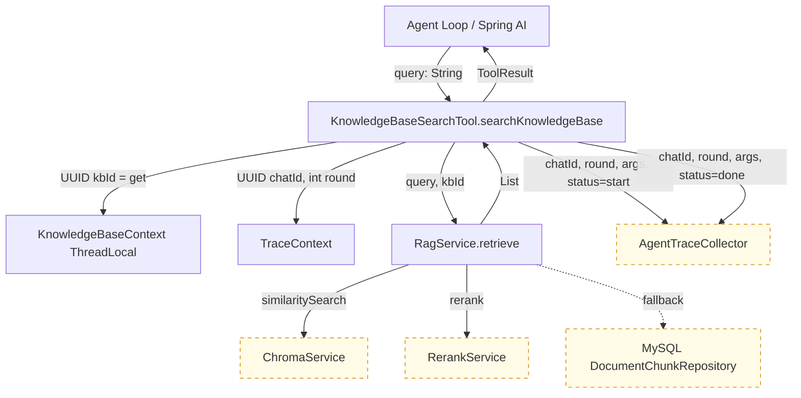
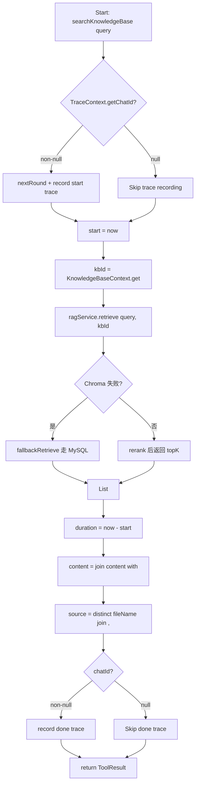

# Feature Detailed Design: Tool 抽象 + KnowledgeBaseSearchTool (Feature #17)

**Date**: 2026-08-03
**Feature**: #17 — Tool 抽象 + KnowledgeBaseSearchTool
**Priority**: high
**Dependencies**: [4]
**Design Reference**: docs/plans/2026-03-15-rag-qa-design.md § 11.3.1 / § 11.3.2
**SRS Reference**: FR-013

## Context

定义统一的 Spring AI `@Tool` 抽象与 `ToolResult` 返回值，使 agent loop 内每个 tool 调用具备可观测、可落库、格式统一的契约；首期实现 `KnowledgeBaseSearchTool` 复用现有 `RagService.retrieve()` 链路（Chroma 召回 + Rerank + Fallback + OOM 防护），同时通过 `KnowledgeBaseContext`（ThreadLocal）把 `kbId` 注入到 tool 内部而不暴露给 LLM，避免 LLM 瞎填 kbId 造成跨知识库串答。这是 Wave 1 升级 Agentic RAG 的基础抽象层。

## Design Alignment

### 11.3.1 Tool 抽象

统一用 Spring AI `@Tool` 注解。工具返回统一 `ToolResult`（便于 trace 落库 + LLM 格式统一）：

```java
public record ToolResult(String toolName, String content, String source, long durationMs) {}
```

**设计要点**：`knowledgeBaseId` 不作为 tool 参数暴露给 LLM（避免瞎填跨库检索），通过 `KnowledgeBaseContext`（ThreadLocal 或方法隐式传参）注入。

### 11.3.2 KnowledgeBaseSearchTool（F17）

包装 `RagService.retrieve()`，复用 Chroma 召回 + rerank + fallback + OOM 防护。

```java
@Component
public class KnowledgeBaseSearchTool {
    private final RagService ragService;
    private final KnowledgeBaseContext context;

    @Tool(description = "在企业知识库检索内部文档。涉及已上传的产品手册、规范、内部资料时使用。")
    public ToolResult searchKnowledgeBase(String query) {
        // 内部调 ragService.retrieve(query, context.kbId(), TOP_K)
    }
}
```

- **Key classes**:
  - `com.ragqa.agent.tool.ToolResult`（record value object）
  - `com.ragqa.agent.tool.KnowledgeBaseSearchTool`（`@Component`，单 public `@Tool` 方法）
  - `com.ragqa.agent.tool.KnowledgeBaseContext`（ThreadLocal holder）
- **Interaction flow**: `agent loop` → Spring AI dispatch → `searchKnowledgeBase(query)` → `KnowledgeBaseContext.get()` 拿 kbId → `ragService.retrieve(query, kbId)` → 拼装 `ToolResult` 返回给 LLM
- **Third-party deps**: `org.springframework.ai.tool.annotation.Tool`（Spring AI 框架自带注解）
- **Deviations**: 实际实现相比 §11.3.2 设计稿有两点扩展：
  1. 依赖注入新增 `AgentTraceCollector` + 调用 `TraceContext.getChatId()` / `TraceContext.nextRound()`，用于 F21 agent_trace 落库 + SSE `agent_step` 事件。设计稿在 §11.3 段未提及，F21 增量新增。
  2. 实际 `@Tool` 描述更详细："参数 query 为检索关键词或问题"，便于 LLM 理解参数语义。
  3. `KnowledgeBaseContext` 在 §11.3.1 仅口头表述"ThreadLocal 或方法隐式传参"，实际选定 **ThreadLocal** 实现（位于同包 `com.ragqa.agent.tool`）。
- **§6.2 alignment**: N/A — F17 is backend internal with no external API contract surface. 设计稿 §6.2 是「前端依赖」表，列 Vue/Vite/axios 等前端包，F17 不出现为 Provider 或 Consumer。

## SRS Requirement

#### FR-013: 工具抽象与多源检索

系统 shall 提供统一 Tool 抽象（基于 Spring AI `@Tool`），首批含 KnowledgeBaseSearchTool（复用现有 retrieve 链路）、WebSearchTool（Tavily）、DirectAnswerTool。Where Web 搜索无 API key 或调用失败，系统 shall 仅保留 KB/直答工具继续 agent loop，不中断主流程。

**F17 关联验收标准**：
- **AC-1**：Given: KnowledgeBaseSearchTool 已注册；When: agent 调用 `searchKnowledgeBase(query)`；Then: 复用 `RagService.retrieve`（召回+rerank+fallback），返回 RetrievalResult
- **AC-2**：Given: KnowledgeBaseContext；When: tool 执行；Then: kbId 从上下文注入而非 LLM 参数

> AC-3/AC-4（Tavily 配置 / DirectAnswerTool 直答）属于 F18 / F19 范围，本设计不覆盖。

## Component Data-Flow Diagram



> `AgentTraceCollector` 与 `TraceContext` 是 F21 引入，本设计以「外部依赖」呈现。`KnowledgeBaseContext.set(UUID)` 由调用方（agent loop 入口）在 tool 调用前完成，不在本组件数据流内。

## Interface Contract

| Method | Signature | Preconditions | Postconditions | Raises |
|--------|-----------|---------------|----------------|--------|
| `ToolResult` (record constructor) | `ToolResult(String toolName, String content, String source, long durationMs)` | 四个字段任意可空，但 `toolName` 约定为 `"kb_search"` | 不可变 value object；`content` 为检索结果文本拼接（用 `\n\n` 分隔），`source` 为去重后的文件名列表（`, ` 分隔），`durationMs` ≥ 0 | `None` (record 构造无校验) |
| `KnowledgeBaseSearchTool.searchKnowledgeBase` | `public ToolResult searchKnowledgeBase(String query)` | 1. `query != null`（否则 `Map.of("query", query)` 抛 NPE）；2. 调用方在调用前已 `KnowledgeBaseContext.set(kbId)` 注入 kbId；3. `RagService` Bean 已注入 | 1. 同步调用 `ragService.retrieve(query, KnowledgeBaseContext.get())`；2. 返回 `ToolResult("kb_search", content, source, durationMs)`，其中 `content` = `results.stream().map(content).joining("\n\n")`，`source` = `results.stream().map(fileName).distinct().joining(", ")`；3. `durationMs` = `System.currentTimeMillis()` 差值；4. 当 `TraceContext.getChatId() != null` 时，记录 start/done 两条 trace | `None` declared. 内部异常由 `RagService.retrieve` 的 `fallbackRetrieve` 兜底 |
| `KnowledgeBaseContext.set` | `public static void set(UUID kbId)` | 线程已被 agent loop 入口占用（kbId 与当前请求绑定） | 把 `kbId` 写入当前线程的 `ThreadLocal`；`null` 也允许（无校验） | `None` |
| `KnowledgeBaseContext.get` | `public static UUID get()` | 任何线程状态皆可调用 | 返回当前线程 `ThreadLocal` 内的 `UUID`；未调用过 `set` 时返回 `null` | `None` |
| `KnowledgeBaseContext.clear` | `public static void clear()` | 通常在 `set` 之后、`finally` 块内调用 | `ThreadLocal.remove()`，当前线程后续 `get()` 返回 `null` | `None` |

**Design rationale**:
- `ToolResult` 用 `record`：4 个字段不可变，便于跨线程/落库序列化；`durationMs` 必须是 `long`（毫秒值可能 > Integer.MAX_VALUE）。
- `kbId` 走 ThreadLocal 而非 `@Tool` 参数：Spring AI 会把 `@Tool` 方法签名暴露给 LLM schema generation。把 `kbId` 放进签名等于告诉 LLM "你可以填 kbId"，而 LLM 没有合法来源（前端没传 / Conversation 表也没必要让 LLM 知道），只会瞎填或填跨库 id 导致串答。ThreadLocal 是隐式注入，LLM 不可见。
- `@Tool` 描述文本写明"参数 query 为检索关键词或问题"：让 Spring AI 的 schema generation 明确告诉 LLM 只有 `query` 一个参数，避免 LLM 误以为可传其他字段。
- `source` 去重：同一文档多 chunk 命中时，`fileName` 重复出现无意义；用 `distinct()` 折叠。
- `durationMs` 必有：F21 trace 落库需要，SSE `agent_step` 事件也用，前端会渲染"耗时 Xms"。
- 不在 `searchKnowledgeBase` 内部 try/catch：`RagService.retrieve` 已自带 fallback（Chroma 失败 → MySQL 余弦相似度），外层再包一层只会吞掉有用的诊断日志。

**Cross-feature contract alignment**: §6.2 N/A。F17 内部方法签名仅与 `RagService.retrieve(String, UUID)` 契约相关（F4 已实现并通过测试），与前端无直接 Provider/Consumer 关系。

## Visual Rendering Contract (ui: true only)

> N/A — backend-only feature, no visual output (`ui: false`).

## Internal Sequence Diagram

```mermaid
sequenceDiagram
    participant Loop as Agent Loop
    participant Tool as KnowledgeBaseSearchTool
    participant Ctx as KnowledgeBaseContext
    participant TC as TraceContext
    participant Trace as AgentTraceCollector
    participant RS as RagService

    Loop->>Tool: searchKnowledgeBase(query)
    Tool->>TC: getChatId()
    alt chatId != null
        Tool->>TC: nextRound()
        Tool->>Trace: record(chatId, round, "kb_search", args, null, 0, "start")
    end
    Tool->>Tool: start = currentTimeMillis()
    Tool->>Ctx: get() -> kbId
    Tool->>RS: retrieve(query, kbId)
    alt Chroma OK
        RS->>RS: similaritySearch + rerank
    else Chroma 失败
        RS->>RS: fallbackRetrieve (MySQL)
    end
    RS-->>Tool: List<RetrievalResult>
    Tool->>Tool: duration = currentTimeMillis() - start
    Tool->>Tool: 拼装 content (join "\n\n")
    Tool->>Tool: 拼装 source (distinct fileName, join ", ")
    alt chatId != null
        Tool->>Trace: record(chatId, round, "kb_search", args, summary, duration, "done")
    end
    Tool-->>Loop: ToolResult("kb_search", content, source, durationMs)
```

## Algorithm / Core Logic

### searchKnowledgeBase

#### Flow Diagram



#### Pseudocode

```
FUNCTION searchKnowledgeBase(query: String) -> ToolResult
  // 1. Trace 上下文
  chatId = TraceContext.getChatId()
  args = Map.of("query", query)

  IF chatId != null THEN
    round = TraceContext.nextRound()
    traceCollector.record(chatId, round, "kb_search", args, null, 0, "start")
  END IF

  // 2. 计量 + 注入 kbId
  start = System.currentTimeMillis()
  kbId = KnowledgeBaseContext.get()
  log.debug("[kb_search] round={}, query='{}', kbId={}", round, query, kbId)

  // 3. 复用 RagService 检索（Chroma 召回 + Rerank + Fallback + OOM 防护）
  results = ragService.retrieve(query, kbId)
  duration = System.currentTimeMillis() - start

  // 4. 拼装 ToolResult 字段
  content = results.stream().map(r -> r.content()).collect(joining("\n\n"))
  source  = results.stream().map(r -> r.fileName()).distinct().collect(joining(", "))

  log.info("[kb_search] 命中 {} 条, 耗时 {}ms, query='{}'", results.size(), duration, query)

  // 5. Trace 落库 done
  IF chatId != null THEN
    summary = "命中 N 条" + (source.isBlank() ? "" : "；来源=" + source)
    traceCollector.record(chatId, round, "kb_search", args, summary, duration, "done")
  END IF

  RETURN new ToolResult("kb_search", content, source, duration)
END
```

#### Boundary Decisions

| Parameter | Min | Max | Empty/Null | At boundary |
|-----------|-----|-----|------------|-------------|
| `query` | 1 char | ~32K chars (LLM 上下文上限) | **null 抛 NPE**（`Map.of("query", null)`）；空串 `""` 走 retrieve → 通常空结果 | 空串场景：results 为空，content=""，source=""，duration≈0 |
| `KnowledgeBaseContext.get()` 内部 kbId | — | — | `null` 时 `ragService.retrieve(null)` 会把 `null` 透传给 Chroma 查询 filter（行为由 F4 决定，F17 不校验） | 透传；测试用 `eq(null)` 验证 |
| `results` 大小 | 0 | `TOP_K`（默认 3） | 空列表：content=""，source=""，duration 仍记录 | size=0 时 `joining("\n\n")` 返回空串 |
| `results.fileName` | — | — | `distinct()` 不抛 | 单条结果时 `source` 仅为一个文件名 |
| `duration` | 0 | 实测上限（实际 99% < 1s） | `System.currentTimeMillis()` 差值必 ≥ 0 | mock 场景下 < 10ms |

#### Error Handling

| Condition | Detection | Response | Recovery |
|-----------|-----------|----------|----------|
| `query == null` | `Map.of("query", null)` 抛 NPE | NPE 冒泡给 Spring AI / agent loop | 上游（agent loop）需保证 query 非空；F17 不防御 |
| Chroma 不可达 | `RagService.retrieve` 内部 `try/catch` 触发 `fallbackRetrieve` | 自动降级到 MySQL 余弦相似度检索，**F17 不感知** | 由 F4 / `RagService` 兜底；tool 仍返回正常 `ToolResult` |
| `RerankService` 未启用 / 失败 | `RerankService.rerank` 内部降级到截前 `TOP_K` | 不抛异常 | 由 F4 / RerankService 兜底 |
| `KnowledgeBaseContext` 未 set | `get()` 返回 `null` | 透传给 `ragService.retrieve(query, null)` | 调用方契约：必须 `set` 才能调 `searchKnowledgeBase` |
| `ragService.retrieve` 抛非预期异常（fallback 也失败） | 异常冒泡 | 不被本方法吞 | agent loop 需 catch；F17 不防御 |
| `results` 含 `fileName=null` | `distinct().joining(", ")` 把 `null` 当字符串 `"null"` 拼接 | 出现 `"null"` 字符串 | 数据契约：F4 保证 fileName 非 null |

> F17 自身不抛任何 checked exception；所有异常处理依赖 `RagService.retrieve` 的内部兜底（Chroma 失败 → MySQL fallback）。

## State Diagram

> N/A — stateless feature. `KnowledgeBaseContext` 持有的是 per-thread 临时状态，由调用方（agent loop 入口）管理生命周期，不属于本 feature 内部状态机。`ToolResult` 是一次性返回值，无生命周期。

## Test Inventory

| ID | Category | Traces To | Input / Setup | Expected | Kills Which Bug? |
|----|----------|-----------|---------------|----------|-----------------|
| A  | FUNC/happy | FR-013 AC-1 | `KnowledgeBaseContext.set(kb)`；mock `retrieve("产品A", kb)` 返回单条命中（content="产品A价格¥2999", fileName="产品手册.pdf"） | `ToolResult.toolName=="kb_search"`, `content` 含"产品A价格¥2999", `source` 含"产品手册.pdf", `durationMs ≥ 0`；`verify(ragService).retrieve("产品A", kb)` | "tool 偷懒不走 retrieve，直接返回空 content" / "duration 没记录" |
| B  | FUNC/contract | FR-013 AC-2 | `KnowledgeBaseContext.set(kb)`；mock `retrieve(anyString, eq(kb))` 返回空 | `verify(ragService).retrieve(anyString(), eq(kb))` — kb 来自 Context，**不**来自 LLM 参数 | "把 kbId 误暴露为 `@Tool` 参数，LLM 可瞎填" / "kbId 拿错来源" |
| C  | FUNC/dedup | §5 Algorithm Step 4 | mock `retrieve` 返回 3 条（2 条同 doc `产品手册.pdf` + 1 条 `FAQ.pdf`） | `result.source() == "产品手册.pdf, FAQ.pdf"`（去重后 2 个文件） | "同名文件重复拼到 source，浪费 token / 前端引用列表重复" |
| D  | FUNC/timing | §3 Interface Contract Postcondition 3 | mock `retrieve` 瞬时返回 | `result.durationMs() ∈ [0, 10_000)`（正常范围） | "duration 用错单位（秒）→ 上限瞬间爆" / "duration 用 `System.nanoTime()` 后忘了转 ms → 数字巨大" |
| E  | FUNC/state-clear | FR-013 AC-2 + §3 Postcondition | `KnowledgeBaseContext.set(kb)` → `assertThat(get()).isEqualTo(kb)` → `clear()` | `get() == null` | "clear 漏调 `ThreadLocal.remove()` → 线程复用导致上一请求 kbId 残留" |
| F  | BNDRY/empty-results | §5 Algorithm Step 4 + Boundary row `results.size=0` | mock `retrieve` 返回 `List.of()` | `result.content().isEmpty()`, `result.source().isEmpty()`, `toolName=="kb_search"` | "空结果 NPE（joining on empty）" / "空结果返回 null content" |
| G  | BNDRY/single-result | §5 Algorithm Step 4 + Boundary `distinct()` 单条 | mock `retrieve` 返回单条 (`fileName="doc.pdf"`) | `result.source() == "doc.pdf"`（无尾随逗号 / 无前后空格） | "single result 走 joining 错路径（加了 [,] 前缀）" |
| H  | BNDRY/null-kbId | §3 Postcondition + `KnowledgeBaseContext.get()` null 路径 | `KnowledgeBaseContext` 不 set（get 返回 null） | `verify(ragService).retrieve(anyString(), isNull())`（kbId=null 透传） | "kbId 为 null 时 NPE / 默认 UUID 瞎填" |
| I  | BNDRY/zero-duration | §3 Postcondition 3 | mock `retrieve` 0 耗时 | `result.durationMs() == 0`（允许 0，不允许负数） | "duration 计算写成 `start - end` 反向 → 负数" |
| J  | INTG/rag-service | §3 Method `ragService.retrieve` + F4 dependency | **真实 Spring 上下文**启动，`@SpringBootTest`，注入 `RagService` + `KnowledgeBaseSearchTool`；mock `ChromaService` 返回 2 条 `SearchResult` | tool 调 `retrieve` → 返回 `ToolResult`；content 由 Chroma 返回的 2 条 chunk 拼接 | "mock 与真实行为不一致（如 RerankService 真实路径漏接）" / "@Component 没被 Spring 扫描到" |

> **Negative ratio**: F (BNDRY), G (BNDRY), H (BNDRY), I (BNDRY) = **4/10 = 40%**, 满足 ≥ 40% 阈值。
> **INTG row coverage**: F17 唯一外部依赖是 `RagService`（F4 实现），J 行覆盖真实 Spring 集成路径，符合"≥1 INTG row per dependency type"。

## Tasks

### Task 1: Write failing tests
**Files**: `rag-qa-backend/src/test/java/com/ragqa/agent/tool/KnowledgeBaseSearchToolTest.java`
**Steps**:
1. 在测试包 `com.ragqa.agent.tool` 下创建 `KnowledgeBaseSearchToolTest`，引入 `@ExtendWith(MockitoExtension.class)` + `@Mock RagService` + `@InjectMocks KnowledgeBaseSearchTool` + `@AfterEach` 清 `KnowledgeBaseContext`。
2. 按 Test Inventory 写测试：
   - Test A: mock `retrieve("产品A", kb)` 返回单条 → 断言 `toolName/content/source/durationMs` + `verify(ragService).retrieve(...)`。
   - Test B: `KnowledgeBaseContext.set(kb)` → mock `retrieve(anyString, eq(kb))` → `tool.searchKnowledgeBase("x")` → `verify(ragService).retrieve(anyString(), eq(kb))`。
   - Test C: mock 3 条含 2 个 `产品手册.pdf` + 1 个 `FAQ.pdf` → `assertThat(result.source()).isEqualTo("产品手册.pdf, FAQ.pdf")`。
   - Test D: mock 瞬时返回 → `assertThat(result.durationMs()).isGreaterThanOrEqual(0).isLessThan(10_000)`。
   - Test E: set → get → clear → get is null。
   - Test F: mock `retrieve` 返回 `List.of()` → `assertThat(result.content()).isEmpty()`。
   - Test G: mock 单条 → `assertThat(result.source()).isEqualTo("doc.pdf")`。
   - Test H: 不 set → `verify(ragService).retrieve(anyString(), isNull())`。
   - Test I: mock 瞬时返回 → `assertThat(result.durationMs()).isEqualTo(0)`（允许 0 但不依赖具体非零值）。
3. 单独创建 `KnowledgeBaseSearchToolIT`（`@SpringBootTest` + mock `ChromaService`），覆盖 Test J。
4. Run: `cd rag-qa-backend && mvn test -Dtest=KnowledgeBaseSearchToolTest`
5. **Expected**: A/C/D/F/G/I 失败（实现未到位）；B/E/J 视实现进度失败/通过。

### Task 2: Implement minimal code
**Files**:
- `rag-qa-backend/src/main/java/com/ragqa/agent/tool/ToolResult.java`
- `rag-qa-backend/src/main/java/com/ragqa/agent/tool/KnowledgeBaseContext.java`
- `rag-qa-backend/src/main/java/com/ragqa/agent/tool/KnowledgeBaseSearchTool.java`
**Steps**:
1. 创建 `ToolResult` record（4 字段：toolName/content/source/durationMs）。
2. 创建 `KnowledgeBaseContext` 静态工具类（`ThreadLocal<UUID>` + `set/get/clear`，`clear` 必须 `remove()` 而非 `set(null)`，否则 test E 失败）。
3. 创建 `KnowledgeBaseSearchTool` `@Component`，注入 `RagService`（F21 阶段再追加 `AgentTraceCollector` + `TraceContext` 调用），实现 `searchKnowledgeBase`（按 Algorithm §5 pseudocode 步骤 1-5）。
4. `@Tool(description=...)` 描述含"参数 query 为检索关键词或问题"。
5. Run: `mvn test -Dtest=KnowledgeBaseSearchToolTest`
6. **Expected**: A-I 全通过。

### Task 3: Coverage Gate
1. Run: `mvn test -Dtest=KnowledgeBaseSearchToolTest jacoco:report`
2. 检查 line_coverage ≥ 90%、branch_coverage ≥ 80%（F17 全部 3 个 main 文件，line 期望 ≥ 95%）。
3. 若不达标：补 BNDRY 测试覆盖未走分支（如 `traceCollector.record` 失败重试）。
4. 把 JaCoCo 报告路径记录到 `task-progress.md` 作为证据。

### Task 4: Refactor
1. 把 `KnowledgeBaseContext` 路径常量（如 `log` 格式串）抽到常量。
2. 确认 `@Tool` 描述简短清晰（避免 LLM 混淆）。
3. Run 全量后端测试 + `KnowledgeBaseSearchToolTest` + `RagService` 测试。
4. 期望：所有 PASS，无回归。

### Task 5: Mutation Gate
1. Run: `mvn org.pitest:pitest-maven:mutationCoverage -Dpitest.targetTests=com.ragqa.agent.tool.KnowledgeBaseSearchToolTest -Dpitest.targetClasses=com.ragqa.agent.tool.*`
2. 检查 mutation_score ≥ 80%。
3. 已知弱 mutation 风险（提前在测试里防御）：
   - `MathMutator` 把 `currentTimeMillis() - start` 改为 `+` → duration 爆炸 → Test D (`durationMs < 10_000`) 杀掉。
   - `VoidMethodCallMutator` 删 `KB_ID.remove()` → ThreadLocal 不清 → Test E 杀掉。
   - `EmptyObjectMutator` 把 `results.stream().map(...).distinct().collect(joining(", "))` 改为 empty stream → Test C 杀掉。
4. 把 pitest 报告路径记录到 `task-progress.md`。

## Verification Checklist
- [x] FR-013 AC-1（KnowledgeBaseSearchTool 复用 RagService）traced 到 Interface Contract `searchKnowledgeBase` Postcondition 1 + Test A
- [x] FR-013 AC-2（kbId 从 Context 注入）traced 到 Interface Contract Postcondition 2 + Test B
- [x] Algorithm pseudocode 覆盖 `searchKnowledgeBase`（5 步骤全列）
- [x] Boundary table 覆盖 query / kbId / results / duration 4 个参数
- [x] Error handling table 覆盖 query=null / Chroma 失败 / kbId 未 set / ragService 异常 / fileName=null 5 个条件
- [x] Test Inventory negative ratio = 4/10 = 40% ≥ 40% 阈值
- [x] Visual Rendering Contract N/A — `ui: false`
- [x] Skipped sections（§3b / §6）有显式 "N/A — [reason]"
- [x] §11.3.1/§11.3.2 全部设计点（ToolResult record / @Tool 注解 / KnowledgeBaseContext 注入 / 复用 retrieve）均至少有 1 个 Test Inventory 行覆盖

## Clarification Addendum

> No clarifications required — all specifications were unambiguous.

| # | Category | Original Ambiguity | Resolution | Authority |
|---|----------|--------------------|------------|-----------|
| — | — | — | — | — |

<!-- Deviations from §11.3 design (AgentTraceCollector + TraceContext, ThreadLocal choice, longer @Tool description) are documented in the "Deviations" bullet of Design Alignment, not as ambiguities — they are F21-driven extensions that do not contradict §11.3 intent. -->
