# RAG智能问答系统 - 设计文档

| 项目 | 内容 |
|------|------|
| **日期** | 2026-03-15 |
| **状态** | 已审批 |
| **SRS参考** | docs/plans/2026-03-15-rag-qa-srs.md |
| **UCD参考** | docs/plans/2026-03-15-rag-qa-ucd.md |

---

## 1. 架构设计

### 1.1 技术选型

| 层级 | 技术 | 版本 |
|------|------|------|
| 后端框架 | Spring AI | 1.0.x |
| 前端框架 | Vue3 | 3.4.x |
| 构建工具 | Vite | 5.x |
| 向量数据库 | Chroma | 0.5.x |
| LLM API | OpenAI兼容API | - |
| 文档解析 | Apache PDFBox + docx4j | 最新稳定版 |

### 1.2 系统架构图

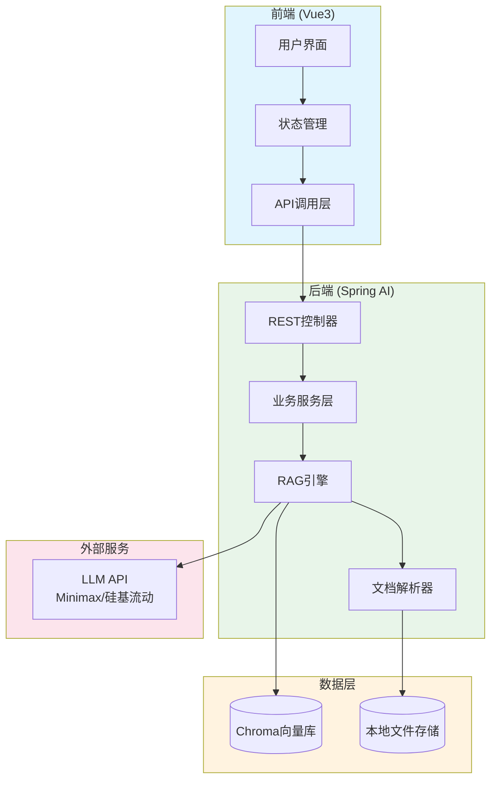

### 1.3 分层架构

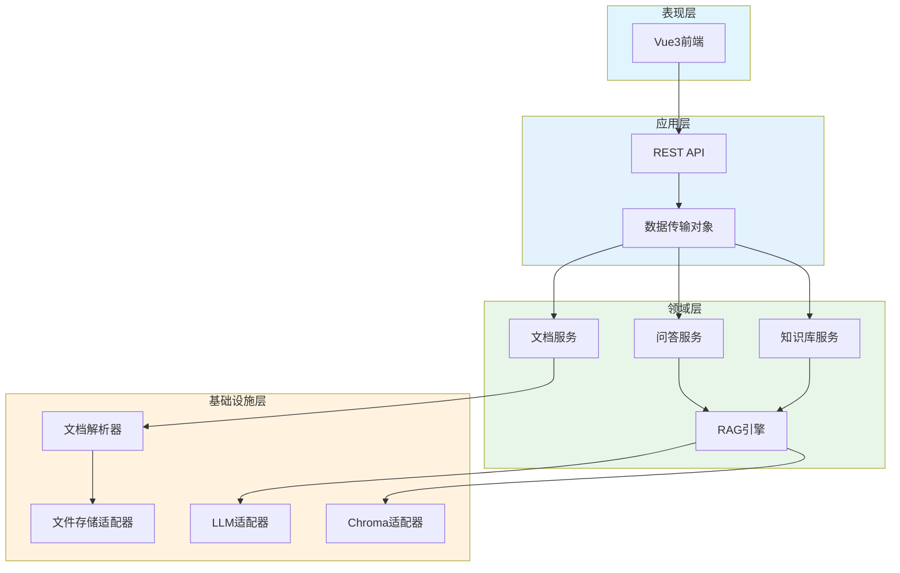

---

## 2. 核心功能设计

### 2.1 知识库管理

#### 类设计

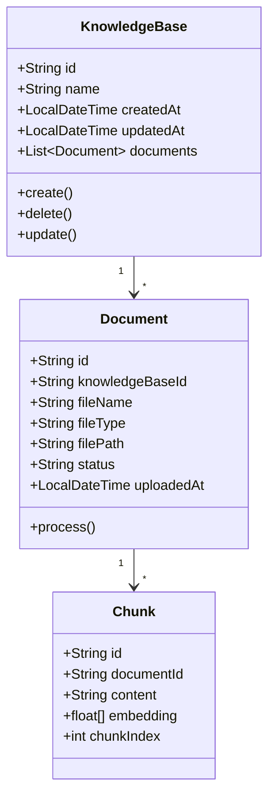

#### 时序图：创建知识库

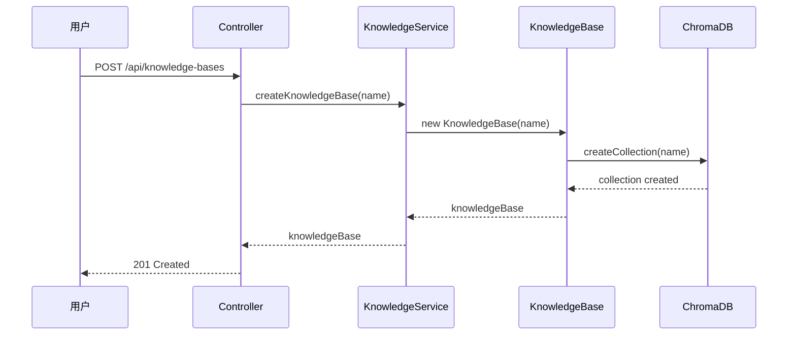

### 2.2 文档上传与处理

#### 类设计

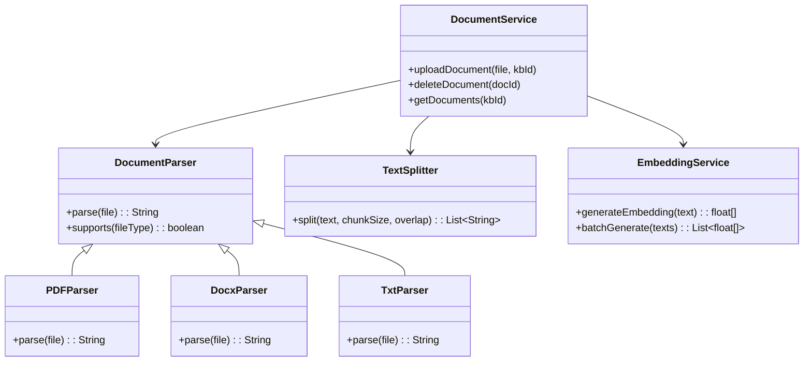

#### 流程图：文档处理

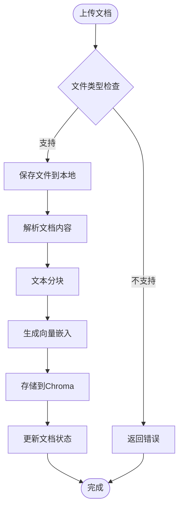

### 2.3 智能问答

#### 类设计

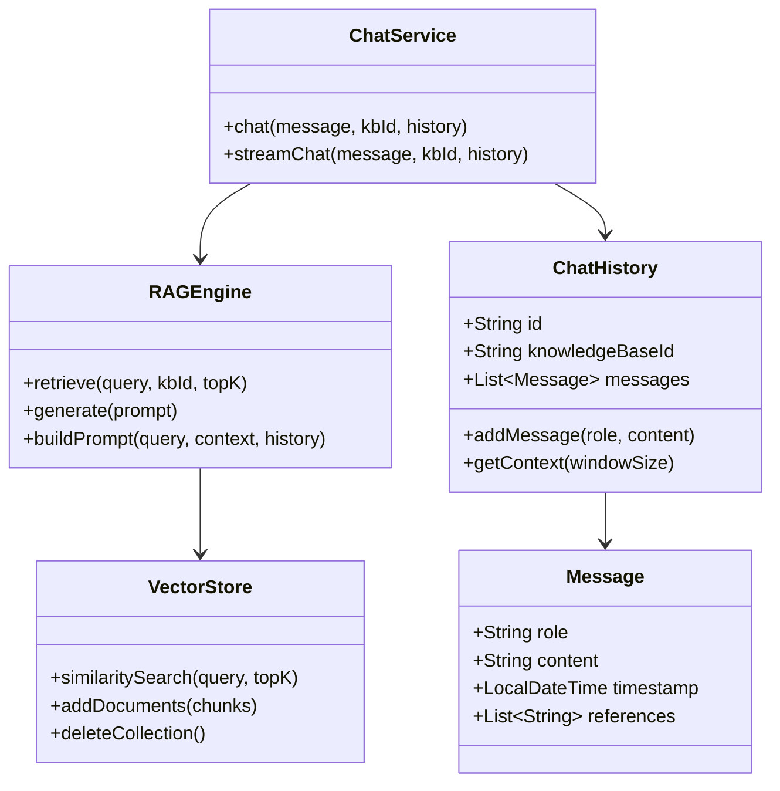

#### 时序图：问答流程

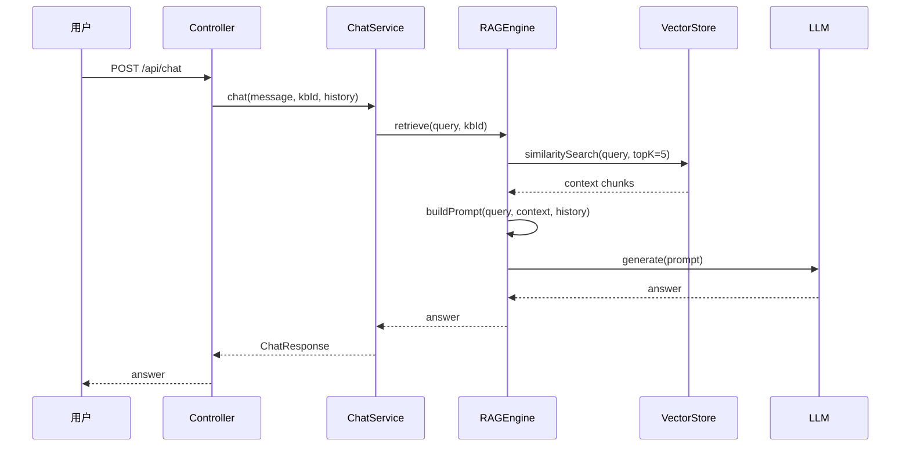

---

## 3. 数据模型

### 3.1 知识库

| 字段 | 类型 | 说明 |
|------|------|------|
| id | UUID | 主键 |
| name | String | 知识库名称 |
| description | String | 描述（可选） |
| created_at | Timestamp | 创建时间 |
| updated_at | Timestamp | 更新时间 |

### 3.2 文档

| 字段 | 类型 | 说明 |
|------|------|------|
| id | UUID | 主键 |
| knowledge_base_id | UUID | 所属知识库 |
| file_name | String | 文件名 |
| file_type | String | 文件类型 (pdf/docx/txt) |
| file_path | String | 文件存储路径 |
| status | Enum | PENDING/PROCESSING/COMPLETED/FAILED |
| chunk_count | Int | 文本块数量 |
| uploaded_at | Timestamp | 上传时间 |
| processed_at | Timestamp | 处理完成时间 |

### 3.3 对话历史

| 字段 | 类型 | 说明 |
|------|------|------|
| id | UUID | 主键 |
| knowledge_base_id | UUID | 所属知识库 |
| messages | JSON | 消息列表 |
| created_at | Timestamp | 创建时间 |

### 3.4 ER图

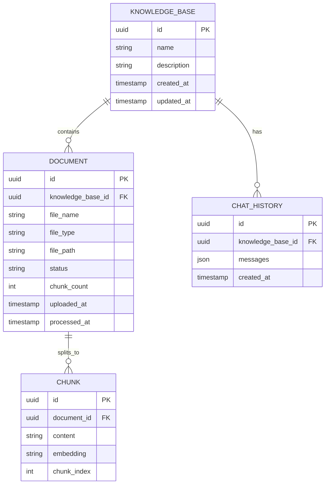

---

## 4. API设计

### 4.1 知识库管理

| 方法 | 路径 | 说明 |
|------|------|------|
| GET | /api/knowledge-bases | 获取知识库列表 |
| POST | /api/knowledge-bases | 创建知识库 |
| GET | /api/knowledge-bases/{id} | 获取知识库详情 |
| PUT | /api/knowledge-bases/{id} | 更新知识库 |
| DELETE | /api/knowledge-bases/{id} | 删除知识库 |

### 4.2 文档管理

| 方法 | 路径 | 说明 |
|------|------|------|
| GET | /api/knowledge-bases/{kbId}/documents | 获取文档列表 |
| POST | /api/knowledge-bases/{kbId}/documents | 上传文档 |
| GET | /api/documents/{id} | 获取文档详情 |
| DELETE | /api/documents/{id} | 删除文档 |

### 4.3 问答

| 方法 | 路径 | 说明 |
|------|------|------|
| POST | /api/chat | 发送问答（非流式） |
| POST | /api/chat/stream | 发送问答（流式） |
| GET | /api/knowledge-bases/{kbId}/history | 获取对话历史 |
| DELETE | /api/knowledge-bases/{kbId}/history | 清空对话历史 |

---

## 5. 前端设计

### 5.1 项目结构

```
rag-qa-frontend/
├── src/
│   ├── components/
│   │   ├── layout/
│   │   │   ├── Sidebar.vue      # 左侧知识库列表
│   │   │   ├── Header.vue       # 顶部导航
│   │   │   └── Layout.vue      # 主布局
│   │   ├── chat/
│   │   │   ├── ChatArea.vue    # 聊天区域
│   │   │   ├── MessageList.vue # 消息列表
│   │   │   ├── MessageBubble.vue # 消息气泡
│   │   │   └── InputArea.vue    # 输入区域
│   │   ├── knowledge/
│   │   │   ├── KnowledgeList.vue  # 知识库列表
│   │   │   ├── KnowledgeCard.vue  # 知识库卡片
│   │   │   └── CreateModal.vue   # 创建弹窗
│   │   └── common/
│   │       ├── Button.vue
│   │       ├── Input.vue
│   │       └── Modal.vue
│   ├── views/
│   │   ├── ChatView.vue        # 聊天主页面
│   │   └── KnowledgeView.vue    # 知识库管理页
│   ├── stores/
│   │   ├── knowledge.ts        # 知识库状态
│   │   └── chat.ts             # 聊天状态
│   ├── api/
│   │   └── index.ts            # API封装
│   ├── styles/
│   │   └── tokens.css          # CSS变量（UCD令牌）
│   ├── App.vue
│   └── main.ts
├── index.html
├── vite.config.ts
└── package.json
```

### 5.2 状态管理

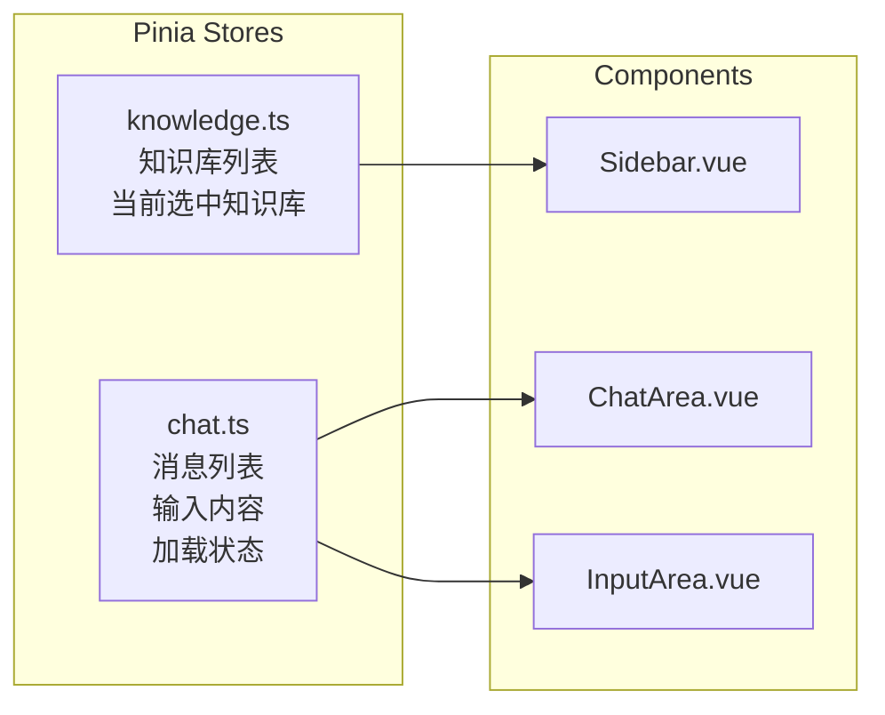

### 5.3 UCD令牌映射

| UCD令牌 | 前端实现 |
|---------|----------|
| --color-primary | CSS变量 `:root { --color-primary: #3B82F6 }` |
| --font-body | `font-family: 'Inter', system-ui, sans-serif` |
| --radius-md | `border-radius: 8px` |
| 组件提示 | Vue组件实现，样式引用CSS变量 |

---

## 6. 第三方依赖

### 6.1 后端依赖

| 依赖 | 版本 | 用途 | 许可证 |
|------|------|------|--------|
| spring-boot-starter-web | 3.2.x | Web框架 | Apache 2.0 |
| spring-ai-starter | 1.0.x | AI框架 | Apache 2.0 |
| spring-ai-openai | 1.0.x | OpenAI兼容API | Apache 2.0 |
| chroma-spring-boot | 0.1.0 | Chroma客户端 | Apache 2.0 |
| pdfbox | 3.0.x | PDF解析 | Apache 2.0 |
| docx4j | 11.x | Word解析 | Apache 2.0 |
| lombok | 最新 | 简化代码 | MIT |
| spring-boot-starter-validation | - | 参数校验 | Apache 2.0 |

### 6.2 前端依赖

| 依赖 | 版本 | 用途 | 许可证 |
|------|------|------|--------|
| vue | 3.4.x | 框架 | MIT |
| vite | 5.x | 构建工具 | MIT |
| vue-router | 4.x | 路由 | MIT |
| pinia | 2.x | 状态管理 | MIT |
| axios | 1.x | HTTP客户端 | MIT |
| lucide-vue-next | 最新 | 图标库 | ISC |
| marked | 12.x | Markdown解析 | MIT |
| @vueuse/core | 10.x | 工具函数 | MIT |

### 6.3 依赖关系图

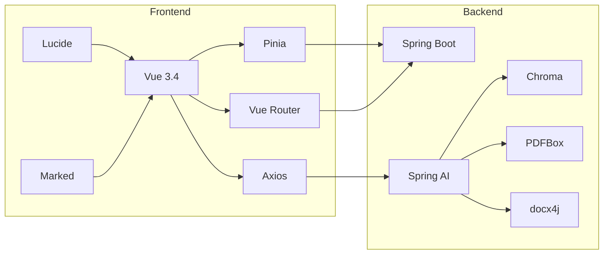

---

## 7. 测试策略

### 7.1 测试分层

| 层级 | 测试类型 | 工具 | 覆盖率目标 |
|------|----------|------|-----------|
| 单元测试 | 业务逻辑 | JUnit 5 + Mockito | >= 70% |
| 集成测试 | API接口 | Spring Boot Test | 核心API全覆盖 |
| E2E测试 | 完整流程 | Playwright | 关键用户路径 |

### 7.2 核心测试用例

| 功能 | 测试场景 |
|------|----------|
| 知识库创建 | 正常创建、重名处理、空名称 |
| 文档上传 | 成功上传、格式验证、大文件处理 |
| 文档解析 | PDF解析、Word解析、Txt解析、解析失败 |
| 向量检索 | 相似内容检索、无结果检索 |
| 问答 | 正常问答、多轮对话、流式输出、异常处理 |

---

## 8. 开发计划

### 8.1 里程碑

| 里程碑 | 阶段 | 范围 | 退出标准 |
|--------|------|------|----------|
| M1 | 基础架构 | 项目初始化、CI/CD、核心抽象 | 项目可运行、单元测试通过 |
| M2 | 知识库管理 | 知识库CRUD、文档上传解析 | 知识库功能可用 |
| M3 | RAG引擎 | 向量存储、检索、LLM集成 | 问答功能可用 |
| M4 | 前端开发 | 聊天界面、知识库管理页面 | 前端功能可用 |
| M5 | 完善发布 | 边缘case、文档、演示 | MVP完成 |

### 8.2 任务分解

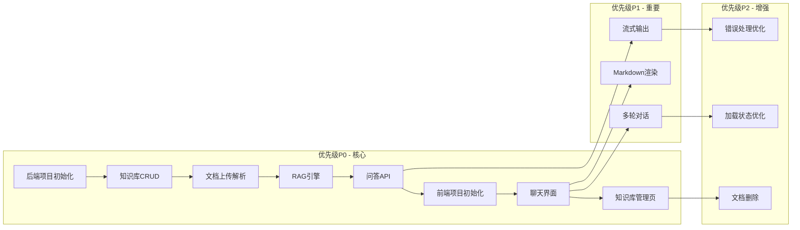

### 8.3 优先级矩阵

| 优先级 | 后端任务 | 前端任务 |
|--------|----------|----------|
| P0 | 项目初始化 | 前端初始化 |
| P0 | 知识库CRUD | 知识库列表页 |
| P0 | 文档上传解析 | 文档上传组件 |
| P0 | RAG引擎 + 问答API | 聊天界面 |
| P1 | 流式输出 | Markdown渲染 |
| P1 | 多轮对话上下文 | 对话历史显示 |
| P2 | 文档删除 | 加载骨架屏 |
| P2 | 错误处理 | 错误提示组件 |

### 8.4 风险与应对

| 风险 | 影响 | 应对措施 |
|------|------|----------|
| 开源模型效果不佳 | 问答质量 | 预留切换到商业模型接口 |
| 大文档处理超时 | 上传失败 | 异步处理 + 进度展示 |
| Chroma并发问题 | 性能瓶颈 | 评估后考虑切换Milvus |

---

**设计文档状态：已审批**

<!-- Design Review: PASS - 2026-03-15 -->
