# RAG智能问答系统 - 设计文档

| 项目 | 内容 |
|------|------|
| **日期** | 2026-03-15（初版），2026-06-27（增量更新） |
| **状态** | 已审批 |
| **SRS参考** | docs/plans/2026-03-15-rag-qa-srs.md |
| **UCD参考** | docs/plans/2026-03-15-rag-qa-ucd.md |
| **本次增量** | P0 安全与稳定性修复（见 §9 变更日志） |

---

## 1. 架构设计

### 1.1 技术选型

| 层级 | 技术 | 版本 |
|------|------|------|
| 后端框架 | Spring AI | 1.0.x |
| 前端框架 | Vue3 | 3.4.x |
| 构建工具 | Vite | 5.x |
| 向量数据库 | Chroma | 0.5.x |
| LLM API | OpenAI兼容API | - |
| 文档解析 | Apache PDFBox + docx4j | 最新稳定版 |

### 1.2 系统架构图

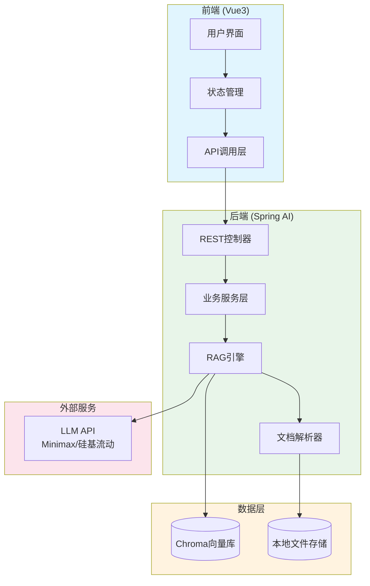
```mermaid
graph TB
    subgraph Frontend["前端 (Vue3)"]
        UI[用户界面]
        Store[状态管理]
        API[API调用层]
    end
    
    subgraph Backend["后端 (Spring AI)"]
        Controller[REST控制器]
        Service[业务服务层]
        RAG[RAG引擎]
        DocParser[文档解析器]
    end
    
    subgraph Data["数据层"]
        ChromaDB[(Chroma向量库)]
        FileStore[(本地文件存储)]
    end
    
    subgraph External["外部服务"]
        LLM[LLM API<br/>Minimax/硅基流动]
    end
    
    UI --> Store
    Store --> API
    API --> Controller
    Controller --> Service
    Service --> RAG
    RAG --> DocParser
    RAG --> ChromaDB
    DocParser --> FileStore
    RAG --> LLM
    
    style Frontend fill:#e1f5fe
    style Backend fill:#e8f5e9
    style Data fill:#fff3e0
    style External fill:#fce4ec
```

### 1.3 分层架构

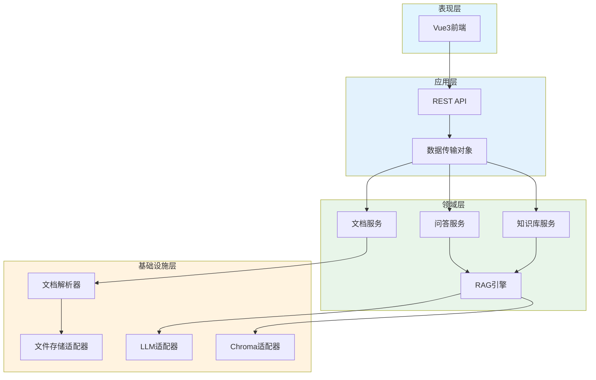
```mermaid
graph TB
    subgraph Presentation["表现层"]
        Vue[Vue3前端]
    end
    
    subgraph Application["应用层"]
        Controller[REST API]
        DTO[数据传输对象]
    end
    
    subgraph Domain["领域层"]
        KnowledgeService[知识库服务]
        ChatService[问答服务]
        DocumentService[文档服务]
        RAGEngine[RAG引擎]
    end
    
    subgraph Infrastructure["基础设施层"]
        ChromaAdapter[Chroma适配器]
        FileAdapter[文件存储适配器]
        LLMAdapter[LLM适配器]
        Parser[文档解析器]
    end
    
    Vue --> Controller
    Controller --> DTO
    DTO --> KnowledgeService
    DTO --> ChatService
    DTO --> DocumentService
    KnowledgeService --> RAGEngine
    ChatService --> RAGEngine
    DocumentService --> Parser
    RAGEngine --> ChromaAdapter
    RAGEngine --> LLMAdapter
    Parser --> FileAdapter
    
    style Presentation fill:#e1f5fe
    style Application fill:#e3f2fd
    style Domain fill:#e8f5e9
    style Infrastructure fill:#fff3e0
```

---

## 2. 核心功能设计

### 2.1 知识库管理

#### 类设计

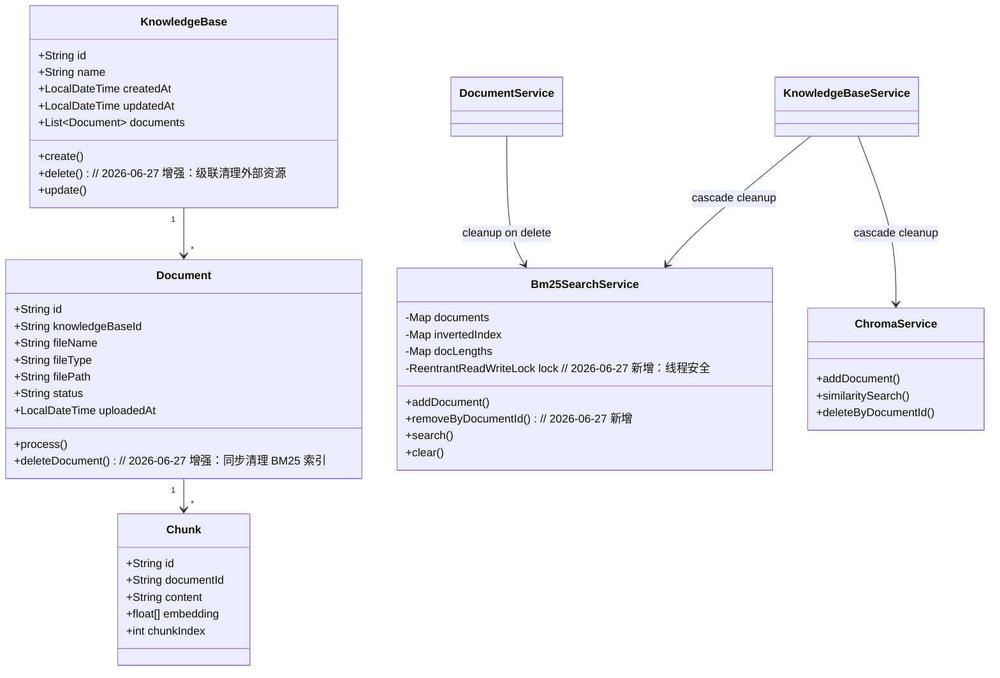
```mermaid
classDiagram
    class KnowledgeBase {
        +String id
        +String name
        +LocalDateTime createdAt
        +LocalDateTime updatedAt
        +List~Document~ documents
        +create()
        +delete()    // 2026-06-27 增强：级联清理外部资源
        +update()
    }

    class Document {
        +String id
        +String knowledgeBaseId
        +String fileName
        +String fileType
        +String filePath
        +String status
        +LocalDateTime uploadedAt
        +process()
        +deleteDocument()  // 2026-06-27 增强：同步清理 BM25 索引
    }

    class Chunk {
        +String id
        +String documentId
        +String content
        +float[] embedding
        +int chunkIndex
    }

    class Bm25SearchService {
        -Map documents
        -Map invertedIndex
        -Map docLengths
        -ReentrantReadWriteLock lock  // 2026-06-27 新增：线程安全
        +addDocument()
        +removeByDocumentId()  // 2026-06-27 新增
        +search()
        +clear()
    }

    class ChromaService {
        +addDocument()
        +similaritySearch()
        +deleteByDocumentId()
    }

    KnowledgeBase "1" --> "*" Document
    Document "1" --> "*" Chunk
    KnowledgeBaseService --> Bm25SearchService : cascade cleanup
    KnowledgeBaseService --> ChromaService : cascade cleanup
    DocumentService --> Bm25SearchService : cleanup on delete
```

#### 时序图：创建知识库

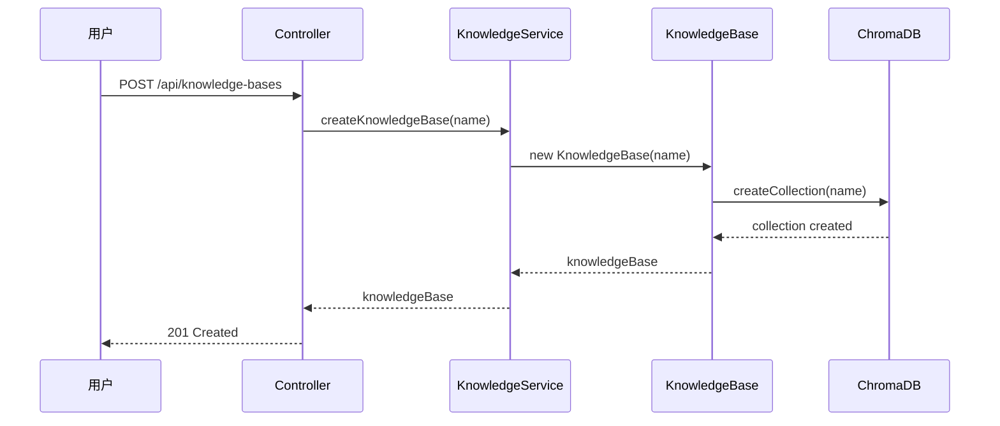
```mermaid
sequenceDiagram
    participant U as 用户
    participant C as Controller
    participant S as KnowledgeService
    participant KB as KnowledgeBase
    participant DB as ChromaDB

    U->>C: POST /api/knowledge-bases
    C->>S: createKnowledgeBase(name)
    S->>KB: new KnowledgeBase(name)
    KB->>DB: createCollection(name)
    DB-->>KB: collection created
    KB-->>S: knowledgeBase
    S-->>C: knowledgeBase
    C-->>U: 201 Created
```

#### 时序图：删除知识库（含级联清理，2026-06-27 修复）

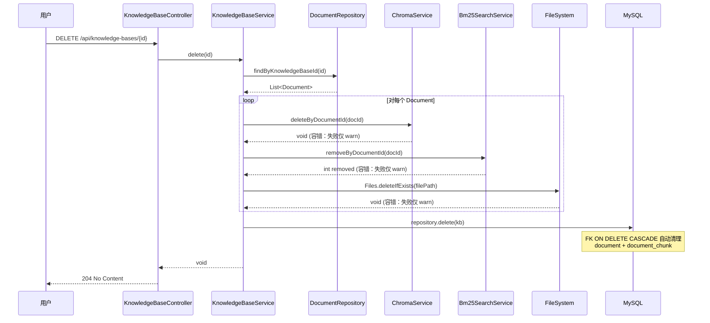
```mermaid
sequenceDiagram
    participant U as 用户
    participant C as KnowledgeBaseController
    participant S as KnowledgeBaseService
    participant DR as DocumentRepository
    participant CS as ChromaService
    participant BM as Bm25SearchService
    participant FS as FileSystem
    participant DB as MySQL

    U->>C: DELETE /api/knowledge-bases/{id}
    C->>S: delete(id)
    S->>DR: findByKnowledgeBaseId(id)
    DR-->>S: List<Document>

    loop 对每个 Document
        S->>CS: deleteByDocumentId(docId)
        CS-->>S: void (容错：失败仅 warn)
        S->>BM: removeByDocumentId(docId)
        BM-->>S: int removed (容错：失败仅 warn)
        S->>FS: Files.deleteIfExists(filePath)
        FS-->>S: void (容错：失败仅 warn)
    end

    S->>DB: repository.delete(kb)
    Note over DB: FK ON DELETE CASCADE 自动清理<br/>document + document_chunk

    S-->>C: void
    C-->>U: 204 No Content
```

**级联清理链路设计**：

| 资源 | 清理方式 | 容错策略 |
|------|----------|----------|
| MySQL `document` / `document_chunk` | FK `ON DELETE CASCADE` 自动级联 | 由 @Transactional 保证整体回滚 |
| MySQL `chat_history.knowledge_base_id` | FK `ON DELETE SET NULL` | 同上 |
| Chroma 向量 | `chromaService.deleteByDocumentId()` | 独立 try-catch，失败仅 warn |
| BM25 内存索引 | `bm25Service.removeByDocumentId()` | 独立 try-catch，失败仅 warn |
| 本地文件 | `Files.deleteIfExists()` | 独立 try-catch，失败仅 warn |

**关键设计决策**：删除 KB 前**必须先调用 `documentRepository.findByKnowledgeBaseId(id)` 抓快照**——一旦执行 `repository.delete(kb)`，FK CASCADE 会瞬间清空 `document` 表，事后无法获取 docId 列表来清理 Chroma/BM25/文件。

### 2.2 文档上传与处理

#### 类设计

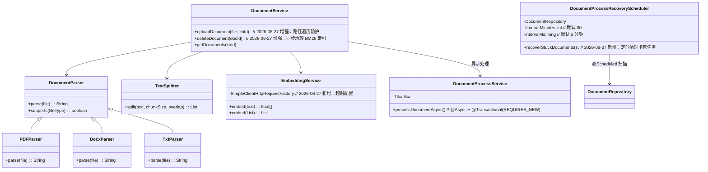
```mermaid
classDiagram
    class DocumentService {
        +uploadDocument(file, kbId)  // 2026-06-27 增强：路径遍历防护
        +deleteDocument(docId)       // 2026-06-27 增强：同步清理 BM25 索引
        +getDocuments(kbId)
    }

    class DocumentParser {
        +parse(file): String
        +supports(fileType): boolean
    }

    class PDFParser {
        +parse(file): String
    }

    class DocxParser {
        +parse(file): String
    }

    class TxtParser {
        +parse(file): String
    }

    class TextSplitter {
        +split(text, chunkSize, overlap): List<String>
    }

    class EmbeddingService {
        -SimpleClientHttpRequestFactory  // 2026-06-27 新增：超时配置
        +embed(text): float[]
        +embed(List<String>): List<float[]>
    }

    class DocumentProcessService {
        -Tika tika
        +processDocumentAsync()  // @Async + @Transactional(REQUIRES_NEW)
    }

    class DocumentProcessRecoveryScheduler {
        -DocumentRepository
        -timeoutMinutes: int      // 默认 30
        -intervalMs: long         // 默认 5 分钟
        +recoverStuckDocuments()  // 2026-06-27 新增：定时清理卡死任务
    }

    DocumentService --> DocumentParser
    DocumentParser <|-- PDFParser
    DocumentParser <|-- DocxParser
    DocumentParser <|-- TxtParser
    DocumentService --> TextSplitter
    DocumentService --> EmbeddingService
    DocumentService --> DocumentProcessService : 异步处理
    DocumentProcessRecoveryScheduler --> DocumentRepository : @Scheduled 扫描
```

#### 流程图：文档处理（2026-06-27 强化版）

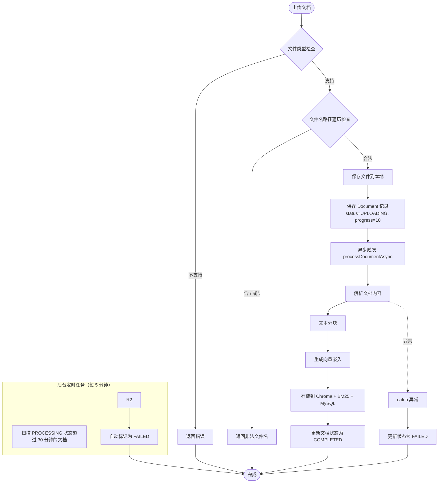
```mermaid
flowchart TD
    Start([上传文档]) --> A1{文件类型检查}
    A1 -->|不支持| E1[返回错误]
    A1 -->|支持| A2{文件名路径遍历检查}
    A2 -->|含 / 或 \ | E2[返回非法文件名]
    A2 -->|合法| B1[保存文件到本地]

    B1 --> B2[保存 Document 记录<br/>status=UPLOADING, progress=10]
    B2 --> B3[异步触发 processDocumentAsync]
    B3 --> B4[解析文档内容]
    B4 --> B5[文本分块]
    B5 --> B6[生成向量嵌入]
    B6 --> B7[存储到 Chroma + BM25 + MySQL]
    B7 --> B8[更新文档状态为 COMPLETED]
    B8 --> End([完成])

    B4 -.异常.-> C1[catch 异常]
    C1 --> C2[更新状态为 FAILED]

    subgraph Recovery["后台定时任务（每 5 分钟）"]
        R1[扫描 PROCESSING 状态超过 30 分钟的文档]
        R2 --> R3[自动标记为 FAILED]
    end

    E1 --> End
    E2 --> End
    C2 --> End
    R3 --> End
```

#### 路径遍历防护设计（2026-06-27 新增）

`DocumentService.uploadDocument` 采用**两层防御**：

```java
// 第一层：拒绝任何包含路径分隔符的文件名
if (fileName != null && (fileName.contains("/") || fileName.contains("\\"))) {
    throw new IllegalArgumentException("非法文件名: " + fileName);
}

// 第二层：getFileName + normalize + 边界校验（防御 NUL 字节等）
Path filePath = uploadPath.resolve(Paths.get(fileName).getFileName()).normalize();
if (!filePath.startsWith(uploadRoot)) {
    throw new IllegalArgumentException("非法文件名: " + fileName);
}
```

**为什么不能只用 `getFileName()`**：`Paths.get("../../etc/passwd.pdf").getFileName()` 返回 `"passwd.pdf"`，单独的边界校验无法发现 `../` 攻击——必须前置显式分隔符检查。

**为什么不能只用分隔符检查**：NUL 字节注入（`passwd.pdf\0.jpg`）、Unicode 同形字符攻击等需要 `normalize()` 兜底。

#### 状态机卡死检测设计（2026-06-27 新增）

```
┌─────────────────┐
│  UPLOADING      │ ─┐
├─────────────────┤  │
│  PARSING        │  ├─ 超过 30 分钟 → 自动 FAILED
├─────────────────┤  │  （DocumentProcessRecoveryScheduler）
│  CHUNKING       │  │  （每 5 分钟扫描一次）
├─────────────────┤  │
│  EMBEDDING      │ ─┘
└─────────────────┘
```

**触发原因**：服务重启 / OOM Kill / 节点宕机 → 异步处理任务被强制终止 → 文档永远卡在中间态。

**修复配置**（`application.properties`）：

```properties
document.recovery.timeout-minutes=30
document.recovery.interval-ms=300000
```

**主类启用**：`RagQaApplication` 加 `@EnableScheduling`。

### 2.3 智能问答

#### 类设计

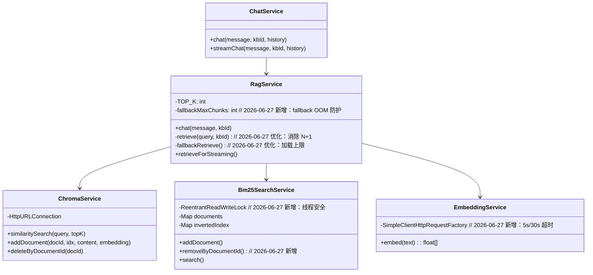
```mermaid
classDiagram
    class ChatService {
        +chat(message, kbId, history)
        +streamChat(message, kbId, history)
    }

    class RagService {
        -TOP_K: int
        -fallbackMaxChunks: int  // 2026-06-27 新增：fallback OOM 防护
        +chat(message, kbId)
        -retrieve(query, kbId)    // 2026-06-27 优化：消除 N+1
        -fallbackRetrieve()       // 2026-06-27 优化：加载上限
        +retrieveForStreaming()
    }

    class ChromaService {
        -HttpURLConnection
        +similaritySearch(query, topK)
        +addDocument(docId, idx, content, embedding)
        +deleteByDocumentId(docId)
    }

    class Bm25SearchService {
        -ReentrantReadWriteLock  // 2026-06-27 新增：线程安全
        -Map documents
        -Map invertedIndex
        +addDocument()
        +removeByDocumentId()  // 2026-06-27 新增
        +search()
    }

    class EmbeddingService {
        -SimpleClientHttpRequestFactory  // 2026-06-27 新增：5s/30s 超时
        +embed(text): float[]
    }

    ChatService --> RagService
    RagService --> ChromaService
    RagService --> Bm25SearchService
    RagService --> EmbeddingService
```

#### 时序图：问答流程（2026-06-27 优化后）

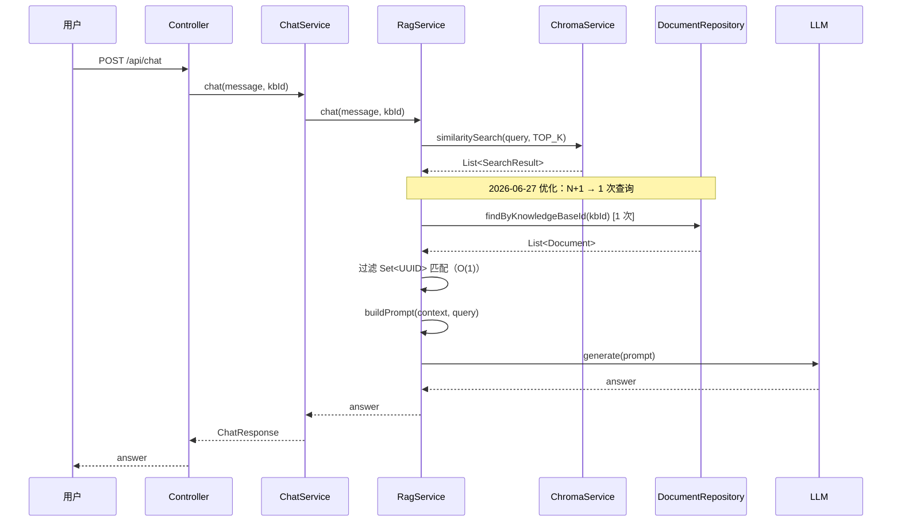
```mermaid
sequenceDiagram
    participant U as 用户
    participant C as Controller
    participant S as ChatService
    participant R as RagService
    participant CS as ChromaService
    participant DR as DocumentRepository
    participant L as LLM

    U->>C: POST /api/chat
    C->>S: chat(message, kbId)
    S->>R: chat(message, kbId)
    R->>CS: similaritySearch(query, TOP_K)
    CS-->>R: List<SearchResult>

    Note over R,DR: 2026-06-27 优化：N+1 → 1 次查询
    R->>DR: findByKnowledgeBaseId(kbId) [1 次]
    DR-->>R: List<Document>
    R->>R: 过滤 Set<UUID> 匹配（O(1)）

    R->>R: buildPrompt(context, query)
    R->>L: generate(prompt)
    L-->>R: answer
    R-->>S: answer
    S-->>C: ChatResponse
    C-->>U: answer
```

#### 检索性能优化（2026-06-27 修复）

| 项 | 修复前 | 修复后 |
|----|--------|--------|
| Chroma 返回 N 个结果的 DB 查询次数 | **N 次**（每次 `findByKnowledgeBaseId`） | **1 次**（提前查询缓存到 `Set<UUID>`） |
| 过滤算法 | O(N × M) 数据库往返 | O(N + M) 内存 Set.contains |
| Fallback 检索最大加载 | 无限（OOM 风险） | **5000 个 chunk**（`fallbackMaxChunks`） |

#### EmbeddingService 超时设计（2026-06-27 新增）

```java
SimpleClientHttpRequestFactory factory = new SimpleClientHttpRequestFactory();
factory.setConnectTimeout(5_000);   // 连接超时 5s
factory.setReadTimeout(30_000);      // 读取超时 30s
this.restTemplate = new RestTemplate(factory);
```

**为什么必须设置超时**：原 RestTemplate 默认无超时。Ollama 服务挂起 / 慢响应 / 网络分区时，HTTP 请求线程会被永久阻塞，最终拖垮整个 Tomcat 线程池。

**异常处理**：捕获 `ResourceAccessException`（超时/网络异常）→ log + 返回空数组，不抛异常给上层。

---

## 3. 数据模型

### 3.1 知识库

| 字段 | 类型 | 说明 |
|------|------|------|
| id | UUID | 主键 |
| name | String | 知识库名称 |
| description | String | 描述（可选） |
| created_at | Timestamp | 创建时间 |
| updated_at | Timestamp | 更新时间 |

### 3.2 文档

| 字段 | 类型 | 说明 |
|------|------|------|
| id | UUID | 主键 |
| knowledge_base_id | UUID | 所属知识库 |
| file_name | String | 文件名 |
| file_type | String | 文件类型 (pdf/docx/txt) |
| file_path | String | 文件存储路径 |
| status | Enum | PENDING/PROCESSING/COMPLETED/FAILED |
| chunk_count | Int | 文本块数量 |
| uploaded_at | Timestamp | 上传时间 |
| processed_at | Timestamp | 处理完成时间 |

### 3.3 对话历史

| 字段 | 类型 | 说明 |
|------|------|------|
| id | UUID | 主键 |
| knowledge_base_id | UUID | 所属知识库 |
| messages | JSON | 消息列表 |
| created_at | Timestamp | 创建时间 |

### 3.4 ER图

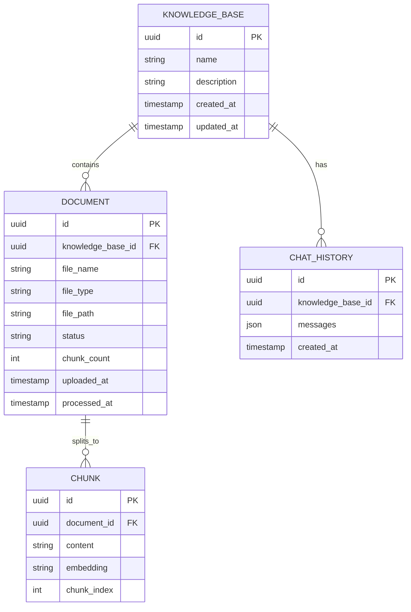
```mermaid
erDiagram
    KNOWLEDGE_BASE ||--o{ DOCUMENT : contains
    KNOWLEDGE_BASE ||--o{ CHAT_HISTORY : has
    DOCUMENT ||--o{ CHUNK : splits_to
    
    KNOWLEDGE_BASE {
        uuid id PK
        string name
        string description
        timestamp created_at
        timestamp updated_at
    }
    
    DOCUMENT {
        uuid id PK
        uuid knowledge_base_id FK
        string file_name
        string file_type
        string file_path
        string status
        int chunk_count
        timestamp uploaded_at
        timestamp processed_at
    }
    
    CHUNK {
        uuid id PK
        uuid document_id FK
        string content
        string embedding
        int chunk_index
    }
    
    CHAT_HISTORY {
        uuid id PK
        uuid knowledge_base_id FK
        json messages
        timestamp created_at
    }
```

---

## 4. API设计

### 4.1 知识库管理

| 方法 | 路径 | 说明 |
|------|------|------|
| GET | /api/knowledge-bases | 获取知识库列表 |
| POST | /api/knowledge-bases | 创建知识库 |
| GET | /api/knowledge-bases/{id} | 获取知识库详情 |
| PUT | /api/knowledge-bases/{id} | 更新知识库 |
| DELETE | /api/knowledge-bases/{id} | 删除知识库 |

### 4.2 文档管理

| 方法 | 路径 | 说明 |
|------|------|------|
| GET | /api/knowledge-bases/{kbId}/documents | 获取文档列表 |
| POST | /api/knowledge-bases/{kbId}/documents | 上传文档 |
| GET | /api/documents/{id} | 获取文档详情 |
| DELETE | /api/documents/{id} | 删除文档 |

### 4.3 问答

| 方法 | 路径 | 说明 |
|------|------|------|
| POST | /api/chat | 发送问答（非流式） |
| POST | /api/chat/stream | 发送问答（流式） |
| GET | /api/knowledge-bases/{kbId}/history | 获取对话历史 |
| DELETE | /api/knowledge-bases/{kbId}/history | 清空对话历史 |

---

## 5. 前端设计

### 5.1 项目结构

```
rag-qa-frontend/
├── src/
│   ├── components/
│   │   ├── layout/
│   │   │   ├── Sidebar.vue      # 左侧知识库列表
│   │   │   ├── Header.vue       # 顶部导航
│   │   │   └── Layout.vue      # 主布局
│   │   ├── chat/
│   │   │   ├── ChatArea.vue    # 聊天区域
│   │   │   ├── MessageList.vue # 消息列表
│   │   │   ├── MessageBubble.vue # 消息气泡
│   │   │   └── InputArea.vue    # 输入区域
│   │   ├── knowledge/
│   │   │   ├── KnowledgeList.vue  # 知识库列表
│   │   │   ├── KnowledgeCard.vue  # 知识库卡片
│   │   │   └── CreateModal.vue   # 创建弹窗
│   │   └── common/
│   │       ├── Button.vue
│   │       ├── Input.vue
│   │       └── Modal.vue
│   ├── views/
│   │   ├── ChatView.vue        # 聊天主页面
│   │   └── KnowledgeView.vue    # 知识库管理页
│   ├── stores/
│   │   ├── knowledge.ts        # 知识库状态
│   │   └── chat.ts             # 聊天状态
│   ├── api/
│   │   └── index.ts            # API封装
│   ├── styles/
│   │   └── tokens.css          # CSS变量（UCD令牌）
│   ├── App.vue
│   └── main.ts
├── index.html
├── vite.config.ts
└── package.json
```

### 5.2 状态管理

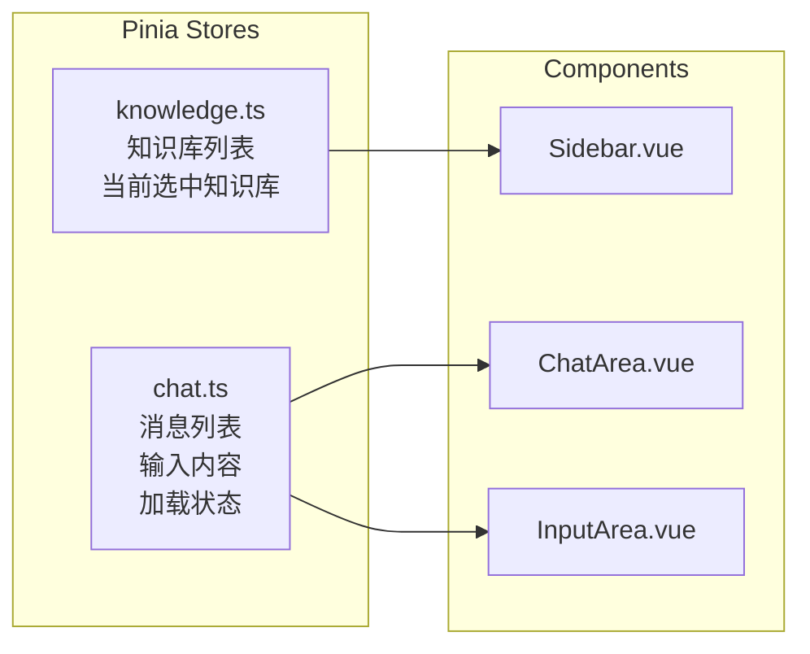
```mermaid
graph LR
    subgraph Pinia Stores
        KB[knowledge.ts<br/>知识库列表<br/>当前选中知识库]
        CH[chat.ts<br/>消息列表<br/>输入内容<br/>加载状态]
    end
    
    subgraph Components
        SL[Sidebar.vue]
        CL[ChatArea.vue]
        IL[InputArea.vue]
    end
    
    KB --> SL
    CH --> CL
    CH --> IL
```

### 5.3 UCD令牌映射

| UCD令牌 | 前端实现 |
|---------|----------|
| --color-primary | CSS变量 `:root { --color-primary: #3B82F6 }` |
| --font-body | `font-family: 'Inter', system-ui, sans-serif` |
| --radius-md | `border-radius: 8px` |
| 组件提示 | Vue组件实现，样式引用CSS变量 |

---

## 6. 第三方依赖

### 6.1 后端依赖

| 依赖 | 版本 | 用途 | 许可证 |
|------|------|------|--------|
| spring-boot-starter-web | 3.2.x | Web框架 | Apache 2.0 |
| spring-ai-starter | 1.0.x | AI框架 | Apache 2.0 |
| spring-ai-openai | 1.0.x | OpenAI兼容API | Apache 2.0 |
| chroma-spring-boot | 0.1.0 | Chroma客户端 | Apache 2.0 |
| pdfbox | 3.0.x | PDF解析 | Apache 2.0 |
| docx4j | 11.x | Word解析 | Apache 2.0 |
| lombok | 最新 | 简化代码 | MIT |
| spring-boot-starter-validation | - | 参数校验 | Apache 2.0 |

### 6.2 前端依赖

| 依赖 | 版本 | 用途 | 许可证 |
|------|------|------|--------|
| vue | 3.4.x | 框架 | MIT |
| vite | 5.x | 构建工具 | MIT |
| vue-router | 4.x | 路由 | MIT |
| pinia | 2.x | 状态管理 | MIT |
| axios | 1.x | HTTP客户端 | MIT |
| lucide-vue-next | 最新 | 图标库 | ISC |
| marked | 12.x | Markdown解析 | MIT |
| @vueuse/core | 10.x | 工具函数 | MIT |

### 6.3 依赖关系图

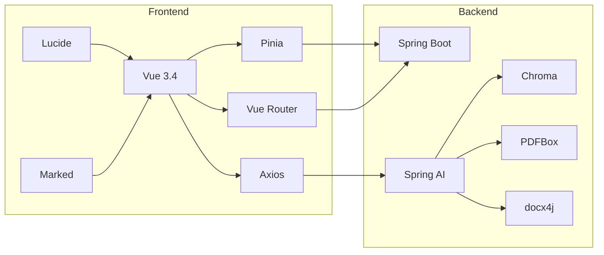
```mermaid
graph LR
    subgraph Frontend
        V[Vue 3.4]
        VR[Vue Router]
        P[Pinia]
        A[Axios]
        L[Lucide]
        M[Marked]
    end
    
    subgraph Backend
        SB[Spring Boot]
        SAI[Spring AI]
        CH[Chroma]
        PB[PDFBox]
        D4J[docx4j]
    end
    
    V --> VR
    V --> P
    V --> A
    A --> SAI
    P --> SB
    VR --> SB
    L --> V
    M --> V
    SAI --> CH
    SAI --> PB
    SAI --> D4J
```

---

## 7. 测试策略

### 7.1 测试分层

| 层级 | 测试类型 | 工具 | 覆盖率目标 |
|------|----------|------|-----------|
| 单元测试 | 业务逻辑 | JUnit 5 + Mockito | >= 70% |
| 集成测试 | API接口 | Spring Boot Test | 核心API全覆盖 |
| E2E测试 | 完整流程 | Playwright | 关键用户路径 |

### 7.2 核心测试用例

| 功能 | 测试场景 |
|------|----------|
| 知识库创建 | 正常创建、重名处理、空名称 |
| 文档上传 | 成功上传、格式验证、大文件处理 |
| 文档解析 | PDF解析、Word解析、Txt解析、解析失败 |
| 向量检索 | 相似内容检索、无结果检索 |
| 问答 | 正常问答、多轮对话、流式输出、异常处理 |

---

## 8. 开发计划

### 8.1 里程碑

| 里程碑 | 阶段 | 范围 | 退出标准 |
|--------|------|------|----------|
| M1 | 基础架构 | 项目初始化、CI/CD、核心抽象 | 项目可运行、单元测试通过 |
| M2 | 知识库管理 | 知识库CRUD、文档上传解析 | 知识库功能可用 |
| M3 | RAG引擎 | 向量存储、检索、LLM集成 | 问答功能可用 |
| M4 | 前端开发 | 聊天界面、知识库管理页面 | 前端功能可用 |
| M5 | 完善发布 | 边缘case、文档、演示 | MVP完成 |

### 8.2 任务分解

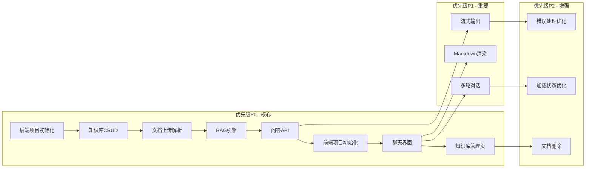
```mermaid
graph LR
    subgraph P0[优先级P0 - 核心]
        A[后端项目初始化] --> B[知识库CRUD]
        B --> C[文档上传解析]
        C --> D[RAG引擎]
        D --> E[问答API]
        E --> F[前端项目初始化]
        F --> G[聊天界面]
        G --> H[知识库管理页]
    end
    
    subgraph P1[优先级P1 - 重要]
        I[流式输出]
        J[多轮对话]
        K[Markdown渲染]
    end
    
    subgraph P2[优先级P2 - 增强]
        L[文档删除]
        M[错误处理优化]
        N[加载状态优化]
    end
    
    E --> I
    G --> J
    G --> K
    H --> L
    I --> M
    J --> N
```

### 8.3 优先级矩阵

| 优先级 | 后端任务 | 前端任务 |
|--------|----------|----------|
| P0 | 项目初始化 | 前端初始化 |
| P0 | 知识库CRUD | 知识库列表页 |
| P0 | 文档上传解析 | 文档上传组件 |
| P0 | RAG引擎 + 问答API | 聊天界面 |
| P1 | 流式输出 | Markdown渲染 |
| P1 | 多轮对话上下文 | 对话历史显示 |
| P2 | 文档删除 | 加载骨架屏 |
| P2 | 错误处理 | 错误提示组件 |

### 8.4 风险与应对

| 风险 | 影响 | 应对措施 |
|------|------|----------|
| 开源模型效果不佳 | 问答质量 | 预留切换到商业模型接口 |
| 大文档处理超时 | 上传失败 | 异步处理 + 进度展示 |
| Chroma 并发问题 | 性能瓶颈 | 评估后考虑切换 Milvus |
| **BM25 索引并发不安全**（2026-06-27 修复）| ConcurrentModificationException / 死循环 | 改用 `ReentrantReadWriteLock`，idfCache 用 `ConcurrentHashMap` |
| **RAG 检索 N+1 查询**（2026-06-27 修复）| TopK×次数 DB 查询 | 提前 `findByKnowledgeBaseId` → `Set<UUID>.contains` |
| **Fallback 全量加载 OOM**（2026-06-27 修复）| 4096 维 × N chunks 占满堆 | 引入 `fallbackMaxChunks` 上限（默认 5000） |
| **EmbeddingService 无超时**（2026-06-27 修复）| Tomcat 线程池雪崩 | `SimpleClientHttpRequestFactory` 设 5s/30s 超时 |
| **文件上传路径遍历**（2026-06-27 修复）| 攻击者越权写文件 | 双层防御：分隔符检查 + normalize + 边界校验 |
| **文档处理状态机卡死**（2026-06-27 修复）| 服务重启后任务永远卡中间态 | `DocumentProcessRecoveryScheduler` 每 5 分钟扫描 |
| **JWT Secret 硬编码**（2026-06-27 修复）| 攻击者可伪造 token | 强制 `JWT_SECRET` 环境变量 + 启动校验 ≥32 字节 |
| **删除知识库数据残留**（2026-06-27 修复）| Chroma/BM25/文件孤儿 | `KnowledgeBaseService.delete` 级联清理三处外部资源 |

---

**设计文档状态：已审批**

---

## 9. 变更日志

### 9.1 2026-06-27：P0 安全与稳定性修复

**背景**：完成接手后的代码审查 + 全量测试套件修复后，识别出 8 项高风险点并实施修复。

**修复明细**：

| ID | 类别 | 文件 | 改动 |
|----|------|------|------|
| FIX-001 | 并发安全 | `Bm25SearchService.java` | 新增 `ReentrantReadWriteLock`；idfCache 改 `ConcurrentHashMap` |
| FIX-002 | 并发安全 | `Bm25SearchService.java` | 新增 `removeByDocumentId(documentId)` 方法 |
| FIX-003 | 数据完整性 | `KnowledgeBaseService.java` | `delete()` 加级联清理：Chroma 向量 + BM25 索引 + 本地文件 |
| FIX-004 | 数据完整性 | `DocumentService.java` | `deleteDocument()` 同步清理 BM25 索引 |
| FIX-005 | 性能 | `RagService.java` | `retrieve()` 消除 N+1 查询（TopK×次 → 1 次） |
| FIX-006 | 性能 | `RagService.java` | `fallbackRetrieve()` 加 `fallbackMaxChunks` 防 OOM |
| FIX-007 | 稳定性 | `EmbeddingService.java` | RestTemplate 设 5s/30s 超时；捕获 `ResourceAccessException` |
| FIX-008 | 安全 | `DocumentService.java` | `uploadDocument()` 路径遍历双层防御 |
| FIX-009 | 可靠性 | `DocumentProcessRecoveryScheduler.java`（新） | `@Scheduled` 定时清理卡死文档 |
| FIX-010 | 安全 | `JwtService.java` + `application.properties` | 强制 `JWT_SECRET` 环境变量；启动校验 ≥32 字节 |

**新增文件**：
- `service/DocumentProcessRecoveryScheduler.java` — 状态机恢复调度器
- `test/service/Bm25SearchServiceTest.java` — BM25 索引单元测试（含并发测试）

**改动文件**（主代码 8 个 + 测试 4 个）：
- 主代码：`Bm25SearchService.java`、`KnowledgeBaseService.java`、`DocumentService.java`、`RagService.java`、`EmbeddingService.java`、`JwtService.java`、`RagQaApplication.java`、`application.properties`
- 测试：`KnowledgeBaseServiceTest.java`、`DocumentServiceTest.java`、`Bm25SearchServiceTest.java`（新）

**测试覆盖**：
- 修复前：27 个测试（部分失败）
- 修复后：**44 个测试全部通过**

新增关键测试：
- `shouldRejectPathTraversalFilename` — `../../etc/passwd.pdf` 攻击拦截
- `shouldRejectAbsolutePathFilename` — `/etc/passwd.pdf` 拦截
- `shouldRejectBackslashPathFilename` — `..\\..\\windows\\evil.pdf` 拦截
- `shouldHandleConcurrentReadsAndWrites` — 8 reader + 2 writer 100 次迭代无异常

**部署注意事项**：
1. **必须设置 `JWT_SECRET` 环境变量**（≥ 32 字节 Base64 编码），启动会校验缺失
   ```bash
   export JWT_SECRET=$(openssl rand -base64 32)
   ```
2. Chroma / Ollama 不可用时，`EmbeddingService` 和 `KnowledgeBaseService.delete()` 不再阻塞但会写 warn 日志
3. 调度任务 `document.recovery.interval-ms=300000`（5 分钟）可根据业务量调整

### 9.2 2026-03-15：初版

详见正文各章节。

### 9.3 2026-06-27 SSE 增量

| 修复 ID | 关联需求 | 简述 |
|---------|----------|------|
| FIX-011 | FR-002 / NFR-007 | 引入 Sinks.Many 事件总线 |
| FIX-012 | FR-002 | 新增 SSE 端点 + query param token 鉴权 |
| FIX-013 | FR-002 | DocumentProcessService 集成事件发布 |
| FIX-014 | FR-002 / NFR-005 | 前端 EventSource composable + 乐观插入 |
| FIX-015 | NFR-007 | SSE 失败自动降级到轮询 |
| FIX-016 | NFR-005 | 全局 Toast 通知系统（替代 alert） |

### 9.4 2026-06-27 Chroma 409 修复

| 修复 ID | 关联需求 | 简述 |
|---------|----------|------|
| FIX-017 | FR-002 / NFR-007 | ChromaService `getOrCreateCollectionId()` 改造：先 GET 列表按 name 命中返回 id，不存在再 POST 创建；加 volatile 缓存 + tenant 级锁避免并发首调竞态；新增 `invalidateCollectionIdCache()` |

**问题现象**：每片切片 add 时无脑 POST 创建 collection，第 1 片成功后 2~71 片全部因 409 `Collection already exists` 失败，导致 `成功: 0, 失败: 71`，文档卡在 FAILED。

**根因**：Chroma v2 API（1.0.x）对同名 collection 严格返回 409；旧实现只 POST、不 GET 复用。

**修复证据**：E2E 跑 cloud.pdf（71 切片）→ `成功: 71, 失败: 0`，Chroma count 端点确认 71 条向量；后端日志 0 个 409。

详细代码：`src/main/java/com/ragqa/service/ChromaService.java`（getOrCreateCollectionId、getFromChroma、invalidateCollectionIdCache）。

---

**设计文档状态：已审批（含 2026-06-27 增量更新）**

---

**设计文档状态：已审批（含 2026-06-27 增量更新）**

<!-- Design Review: PASS - 2026-03-15 -->
<!-- Design Review: PASS (增量) - 2026-06-27 -->

---

## 10. 前端文档状态实时同步（2026-06-27 增量）

### 10.1 问题

用户上传文档后，前端 UI 卡在"上传中 10%"不更新，状态变更需等下一次 2 秒轮询才能看到。

**根因**（已确诊）：
1. `alert()` 阻塞主线程 — 用户点 OK 前 JS 完全冻结
2. 缺乐观插入 — 后端上传响应里返回的 `Document(status=UPLOADING, progress=10)` 被丢弃
3. 轮询固定 2s — 即便状态已变更，也要等下一次轮询
4. 轮询停止条件激进 — 一旦没有"处理中"就停，可能漏掉刚上传的文档
5. 无错误重试 — 轮询失败静默
6. **缺 SSE 实时推送** — 最根本的延迟来源

### 10.2 架构

```
┌──────────────────────────────────────────────────────────┐
│  前端 ChatView.vue                                       │
│                                                            │
│  useDocumentStream(kbId)                                  │
│    ├─ Primary:  EventSource('/api/.../stream?token=...') │
│    │             ↓ 断线                                    │
│    │           reconnect (exp backoff 1s/2s/4s/.../30s)   │
│    │             ↓ 重连 6 次失败                           │
│    └─ Fallback: setInterval(3000ms) 轮询                 │
│                                                            │
│  useToast()  ← 全局 toast 队列                            │
└────────────────┬─────────────────────────────────────────┘
                 │ HTTP GET /api/knowledge-bases/{kbId}/documents/stream?token=xxx
                 ▼
┌──────────────────────────────────────────────────────────┐
│  后端 DocumentController                                  │
│    @GetMapping("/.../stream")                             │
│    public Flux<ServerSentEvent<String>> streamDocStatus() │
│      ├─ 鉴权检查（header 优先 / query token 备选）        │
│      ├─ subscribe to Sinks.Many<DocumentStatusEvent>     │
│      └─ map to ServerSentEvent.event("doc-status")       │
└────────────────┬─────────────────────────────────────────┘
                 │
                 ▼
┌──────────────────────────────────────────────────────────┐
│  DocumentStatusEventService (新)                          │
│    ConcurrentMap<UUID, Sinks.Many<DocumentStatusEvent>>  │
│      ├─ emit(kbId, event)    →  tryEmitNext()            │
│      ├─ getOrCreateSink(kbId) →  multicast + buffer(100) │
│      └─ removeSink(kbId)      →  tryEmitComplete         │
│                                                            │
│  DocumentProcessService (改)                              │
│    @Async "documentProcessExecutor"                       │
│    public void processDocumentAsync(...)                  │
│      └─ saveAndEmit(doc)  // 5 个状态变更点                │
└──────────────────────────────────────────────────────────┘
```

### 10.3 选型理由

| 候选方案 | 优劣 | 决策 |
|---------|------|------|
| `Sinks.Many.multicast()` ✅ | 线程安全、backpressure、buffer replay、天然适配 Flux SSE 端点、与现有 `ChatController.streamChat` 风格一致 | **采用** |
| `ApplicationEventPublisher` ❌ | 简单但每订阅者需要 @EventListener 样板代码，无法直接转 SSE 流 | 拒绝 |
| `SseEmitter` 手动管理 ❌ | 需自己维护 `Map<UUID, List<SseEmitter>>`，多线程同步复杂 | 拒绝 |
| 纯轮询（之前）❌ | 简单但延迟 ≥2s，无法实时 | 拒绝 |
| WebSocket ❌ | 双向通信，当前需求单向推送 | 过度设计 |

### 10.4 安全权衡 — EventSource + JWT

**问题**：浏览器 `EventSource` API 不支持自定义 header（W3C 规范），但项目用 JWT + localStorage。

**方案对比**：
- ❌ HttpOnly cookie：需前后端双重改造，超出本次范围
- ✅ **Query param `?token=xxx`**：单端点改造，浏览器原生 SSE 自动重连保留 query
- ❌ fetch + ReadableStream：失去浏览器原生重连

**风险**：
1. Token 出现在 URL → 可能被代理/浏览器历史/服务端访问日志记录
2. SSE 长连接 → 增加 token 暴露窗口

**缓解措施**（已实施）：
1. Token 在 query 中通过 `encodeURIComponent` 编码
2. 后端 controller 在每次请求时验证 token 签名（`jwtService.extractUsername`）
3. 前端 EventSource 自动重连时附带当前 localStorage 中的最新 token

**未来优化**（SDD 跟踪）：
- 生产部署建议改 HttpOnly Cookie + CSRF Token
- 短期 token（5 分钟）+ 长期 refresh token 双层架构
- nginx `proxy_read_timeout 300s` 配置避免 SSE 被切断

### 10.5 降级策略

```
SSE 连接成功 → 监听 'doc-status' 事件
     ↓ 断线（onerror）
scheduleReconnect()
     ↓
reconnectAttempt < 6 ?
     ├─ Yes → setTimeout(RECONNECT_DELAYS[attempt]) → 重试 SSE
     │          RECONNECT_DELAYS = [1s, 2s, 4s, 8s, 15s, 30s]
     └─ No  → startFallback() → 启用 3s 轮询
                  ↓
              轮询成功 → 继续轮询（不再尝试 SSE，避免反复失败）
```

**关键点**：
- fallback 轮询与 SSE 不互斥：SSE 启动失败时 fallback 已经先跑（覆盖 SSE 启动延迟）
- SSE 成功后会主动停止 fallback（`es.onopen` 钩子）
- 切换 KB 时先 `stop()` 旧的，再 `start()` 新的（防止订阅错乱）

### 10.6 状态机

```
UPLOADING(10%)  ──上传成功──>  PARSING(30%)  ──Tika 解析──>  CHUNKING(50%)
                                                              ↓
EMBEDDING(70%)  ──循环每个 chunk +30/(N)──>  COMPLETED(100%)
     │
     └── 异常 ──> FAILED + errorMessage
```

**事件 payload 字段**：
```json
{
  "documentId": "uuid",
  "knowledgeBaseId": "uuid",
  "status": "PARSING|CHUNKING|EMBEDDING|COMPLETED|FAILED|...",
  "progress": 30,
  "errorMessage": null,
  "updatedAt": "2026-06-27T15:00:00"
}
```

**前端合并策略**：
```js
mergeEvent(event) {
  const idx = documents.value.findIndex(d => d.id === event.documentId)
  if (idx >= 0) {
    // 覆盖更新 — 保留 fileName 等其他字段
    documents.value[idx] = { ...documents.value[idx], ...event }
  } else {
    // 文档不在列表中 → 追加（边界场景：刚切 KB）
    documents.value.push({ id: event.documentId, ...event })
  }
}
```

### 10.7 Toast 系统

替换所有 `alert()` 为非阻塞 toast：

```js
const toast = useToast()
toast.success('文档上传成功，正在处理...')    // 绿色 3s
toast.error('上传失败: ' + errorMsg, 5000)   // 红色 5s
toast.info('正在切换知识库...')                // 蓝色 3s
toast.warning('SSE 断开，已切换到轮询模式')   // 黄色 4s
```

特性：
- 模块级单例 — 全应用共享同一队列
- 自动消失 + 可点击手动 dismiss
- `<TransitionGroup>` 平滑动画
- 不阻塞主线程（替代 alert）

### 10.8 修改文件清单（FIX-011 ~ FIX-016）

| FIX | 文件 | 内容 |
|-----|------|------|
| FIX-011 | `event/DocumentStatusEvent.java` | 新建 record |
| FIX-011 | `event/DocumentStatusEventService.java` | 新建 Sinks 事件总线 |
| FIX-012 | `controller/DocumentController.java` | 新增 SSE 端点 + 鉴权 |
| FIX-013 | `service/DocumentProcessService.java` | 注入事件服务，5 个 emit 点 |
| FIX-013 | `config/GlobalExceptionHandler.java` | 处理 SecurityException → 401 |
| FIX-014 | `composables/useDocumentStream.js` | 新建 SSE+fallback composable |
| FIX-014 | `views/ChatView.vue` | 重构：删轮询、删 alert、加乐观插入 |
| FIX-015 | 同上 | 轮询 fallback 自动接管 |
| FIX-016 | `composables/useToast.js` | 新建 |
| FIX-016 | `components/common/ToastContainer.vue` | 新建 |
| FIX-016 | `main.js` + `App.vue` | 注册 ToastContainer |

### 10.9 验证方式

**后端单元测试**（已通过 10/10）：
```bash
JWT_SECRET=$(openssl rand -base64 32) mvn test \
  -Dtest='DocumentStatusEventServiceTest,DocumentControllerStreamTest'
```

**前端 E2E**（手动）：
```bash
./start.sh
# 浏览器访问 http://localhost:5173
# 上传 PDF → 观察：
#   1. Toast 立即显示"上传成功"（非 alert）
#   2. 文档列表立刻显示新条目（乐观插入）
#   3. progress 实时跳动：10 → 30 → 50 → 70 → ... → 100
#   4. 状态文字实时变化：上传中 → 解析中 → 切分中 → 向量化中 → 已完成
# 关闭后端 → 前端 fallback 自动切到轮询，warn toast 提示
# 重启后端 → SSE 自动重连
```

**测试用例文档**：`docs/test-cases/feature-31-doc-status-sse.md`

---

**设计文档状态：已审批（含 2026-06-27 增量更新）**

<!-- Design Review: PASS - 2026-03-15 -->
<!-- Design Review: PASS (增量) - 2026-06-27 -->
<!-- Design Review: PASS (SSE 增量) - 2026-06-27 -->
