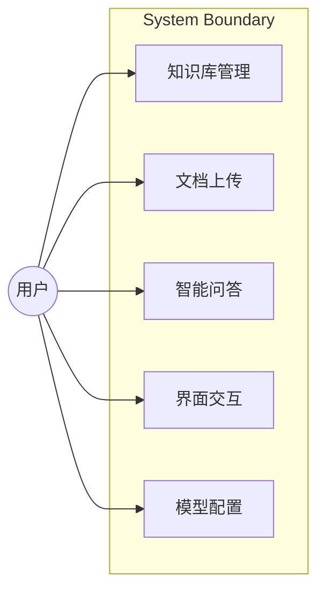
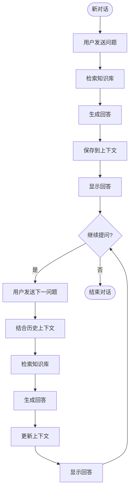

# RAG智能问答系统 - 软件需求规格说明书 (SRS)

| 项目 | 内容 |
|------|------|
| **日期** | 2026-03-15 |
| **状态** | 草稿 |
| **标准** | ISO/IEC/IEEE 29148 |
| **版本** | 1.0 |

## 1. 目的与范围

### 1.1 项目目的

本项目旨在构建一个企业级RAG（检索增强生成）智能问答系统，后端采用Spring AI框架，前端界面类似豆包的聊天交互风格。用户可上传文档构建知识库，通过AI问答助手获取基于知识库的智能回答。

### 1.2 项目范围

**包含范围 (MVP版本)：**
- 文档上传与管理：支持PDF、Word、TXT等常见格式
- 知识库管理：支持创建多个知识库
- 智能问答：基于RAG的多轮对话，支持上下文记忆
- 前端界面：豆包风格的聊天界面（Vue3实现）

**不包含范围：**
- 用户登录与权限管理（MVP版本无需登录）
- 复杂的企业级权限控制
- 移动端适配
- 实时语音对话

### 1.3 目标用户

- 企业内部员工
- 需要基于私有文档进行智能问答的用户
- 技术背景：普通用户，无需编程知识

---

## 2. 术语表

| 术语 | 定义 |
|------|------|
| **RAG (Retrieval Augmented Generation)** | 检索增强生成，一种结合向量检索和LLM生成的技术 |
| **知识库 (Knowledge Base)** | 用户上传文档的集合，用于问答时的信息检索 |
| **向量数据库** | 存储文档向量嵌入的数据库，用于相似度检索 |
| **文档切分** | 将大文档拆分成小块文本，便于向量化和检索 |
| **多轮对话** | 支持上下文记忆的连续对话方式 |
| **LLM** | 大语言模型，用于生成回答 |

---

## 3. 功能需求

### 3.1 文档管理

#### FR-001: 文档上传

当用户选择上传文档时，系统 shall 接受PDF、Word(.docx)、TXT格式的文件，并 shall 将文件存储到知识库中。

**验收标准：**
- Given: 用户处于知识库管理页面
- When: 用户点击上传按钮，选择一个PDF文件并确认
- Then: 系统显示上传进度，文件上传成功后显示在知识库文件列表中

**优先级：** Must

---

#### FR-002: 文档解析与向量化

当文档上传成功后，系统 shall 自动解析文档内容，并 shall 将文本切分成Chunks后进行向量化存储。

**验收标准：**
- Given: 文档已上传成功
- When: 系统开始处理文档
- Then: 文档内容被提取并存储到向量数据库，处理完成后用户可发起问答

**优先级：** Must

---

#### FR-003: 知识库创建

当用户点击创建知识库时，系统 shall 创建一个新的空知识库，并 shall 在知识库列表中显示。

**验收标准：**
- Given: 用户在知识库管理页面
- When: 用户点击"新建知识库"，输入名称后确认
- Then: 新知识库创建成功并显示在列表中

**优先级：** Must

---

#### FR-004: 知识库删除

当用户选择删除知识库时，系统 shall 删除该知识库及其所有关联的向量数据。

**验收标准：**
- Given: 知识库列表中存在至少一个知识库
- When: 用户点击删除按钮并确认删除
- Then: 知识库及其数据被完全删除，列表中不再显示

**优先级：** Should

---

### 3.2 智能问答

#### FR-005: 发起问答

当用户在聊天界面输入问题并发送时，系统 shall 检索知识库相关内容，并 shall 调用LLM生成回答。

**验收标准：**
- Given: 用户已选择知识库并处于聊天界面
- When: 用户输入"什么是RAG？"并发送
- Then: 系统返回基于知识库内容的回答，显示在聊天界面中

**优先级：** Must

---

#### FR-006: 多轮对话上下文

当用户在同一对话中继续提问时，系统 shall 记忆之前的对话上下文，并 shall 在生成回答时考虑历史对话内容。

**验收标准：**
- Given: 用户已进行过一次问答对话
- When: 用户发送第二个问题"它是怎么实现的？"
- Then: 系统结合第一个问题的上下文生成回答

**优先级：** Must

---

#### FR-007: 参考文档展示

当系统返回回答时，系统 shall 展示回答所引用的源文档片段。

**验收标准：**
- Given: 问答返回了回答
- When: 回答生成完成
- Then: 回答下方显示参考的文档来源和片段

**优先级:** Could

---

### 3.3 前端界面

#### FR-008: 左侧知识库列表

系统 shall 在界面左侧显示知识库列表，用户可点击切换当前活跃的知识库。

**验收标准：**
- Given: 用户打开系统
- When: 页面加载完成
- Then: 左侧显示知识库列表，默认选中第一个

**优先级：** Must

---

#### FR-009: 右侧聊天区域

系统 shall 在界面右侧显示聊天区域，包含消息列表和输入框。

**验收标准：**
- Given: 用户选择知识库后
- When: 用户进入聊天界面
- Then: 右侧显示聊天消息列表和输入框

**优先级：** Must

---

#### FR-010: 消息发送与显示

当用户发送消息时，系统 shall 将用户消息和AI回答显示在聊天区域，并 shall 支持 Markdown 渲染。

**验收标准：**
- Given: 用户在输入框中
- When: 用户输入内容并点击发送（或按回车）
- Then: 消息显示在右侧聊天区域，AI回答以流式输出方式显示

**优先级：** Must

---

### 3.4 模型管理

#### FR-011: 多模型切换

系统 shall 支持配置多个LLM模型，并 shall 允许用户或管理员切换当前使用的模型。

**验收标准：**
- Given: 系统已配置多个模型
- When: 用户在设置中选择切换模型
- Then: 后续问答使用新选择的模型

**优先级：** Could

---

## 4. 非功能需求

### 4.1 性能需求

| 需求ID | 描述 | 目标 | 优先级 |
|--------|------|------|--------|
| NFR-001 | 文档上传响应时间 | 用户点击上传后，100KB文件2秒内开始处理 | Should |
| NFR-002 | 问答响应时间 | 首字响应时间 < 5秒 | Should |
| NFR-003 | 向量检索时间 | 百万级向量检索 < 1秒 | Should |

### 4.2 可用性需求

| 需求ID | 描述 | 目标 | 优先级 |
|--------|------|------|--------|
| NFR-004 | 界面加载时间 | 首屏加载 < 3秒 | Should |
| NFR-005 | 错误提示 | 操作失败时提供明确的中文错误提示 | Must |

### 4.3 可靠性需求

| 需求ID | 描述 | 目标 | 优先级 |
|--------|------|------|--------|
| NFR-006 | 数据持久化 | 知识库数据本地持久化存储 | Must |
| NFR-007 | 异常处理 | API异常不导致前端崩溃 | Must |

### 4.4 可维护性需求

| 需求ID | 描述 | 目标 | 优先级 |
|--------|------|------|--------|
| NFR-008 | 配置外置 | LLM API Key等敏感配置通过配置文件管理 | Must |
| NFR-009 | 日志记录 | 关键操作有日志记录 | Should |

---

## 5. 约束

### 5.1 技术约束

| 约束ID | 描述 |
|--------|------|
| CON-001 | 后端必须使用Spring AI框架 |
| CON-002 | 前端必须使用Vue3框架 |
| CON-003 | 向量数据库使用Chroma |
| CON-004 | MVP版本不支持用户登录认证 |
| CON-005 | 部署环境为本地服务器 |

### 5.2 外部约束

| 约束ID | 描述 |
|--------|------|
| CON-006 | 需要LLM API（开源模型：Minimax/硅基流动） |

---

## 6. 假设

| 假设ID | 描述 |
|--------|------|
| ASM-001 | 用户具备基本的电脑操作能力 |
| ASM-002 | 本地服务器有足够的磁盘空间存储文档和向量数据 |
| ASM-003 | 网络环境可以访问LLM API服务 |

---

## 7. 外部接口

### 7.1 用户界面

- **类型**: Web前端
- **框架**: Vue3 + Vite
- **布局**: 左侧知识库列表 + 右侧聊天区域

### 7.2 后端API

- **框架**: Spring AI
- **协议**: HTTP/REST
- **数据格式**: JSON

### 7.3 LLM接口

- **类型**: REST API
- **模型**: 开源模型（Minimax/硅基流动）
- **协议**: OpenAI兼容API

### 7.4 向量数据库

- **类型**: Chroma
- **存储方式**: 本地文件持久化

---

## 8. 用例视图



---

## 9. 流程图

### 9.1 文档上传与问答流程

```mermaid
flowchart TD
    Start([用户上传文档]) --> A1{选择文件}
    A1 -->|选择PDF/Word/TXT| B1[文件上传]
    B1 --> B2[解析文档内容]
    B2 --> B3[文本切分]
    B3 --> B4[向量化存储]
    B4 --> B5[上传成功提示]
    B5 --> End1([完成])
    
    Start2([用户发起问答]) --> C1{选择知识库}
    C1 --> C2[输入问题]
    C2 --> C3[向量检索]
    C3 --> C4[构建Prompt]
    C4 --> C5[调用LLM生成]
    C5 --> C6[返回回答]
    C6 --> C7[展示回答+引用]
    C7 --> End2([完成])
    
    C3 -->|无相关内容| C8[返回"未找到相关信息"]
    C8 --> End2
```

### 9.2 多轮对话流程



---

## 10. 优先级汇总

| 优先级 | 需求数量 | 需求ID |
|--------|----------|---------|
| Must | 7 | FR-001, FR-002, FR-003, FR-005, FR-006, FR-008, FR-009, FR-010, NFR-005, NFR-006, NFR-007, NFR-008 |
| Should | 5 | FR-004, NFR-001, NFR-002, NFR-003, NFR-004, NFR-009 |
| Could | 2 | FR-007, FR-011 |

---

## 11. 风险与开放问题

| 风险/问题 | 描述 | 应对措施 |
|-----------|------|----------|
| 开源模型效果 | 开源模型效果可能不如商业模型 | 预留切换到商业模型的接口 |
| 大文档处理 | 超大文档可能导致处理缓慢 | 文档切分时控制chunk大小 |
| 本地部署网络 | 需要能访问LLM API | 确保网络畅通或考虑本地部署模型 |

---

**SRS状态：已审批**

<!-- SRS Review: PASS - 2026-03-15 -->
