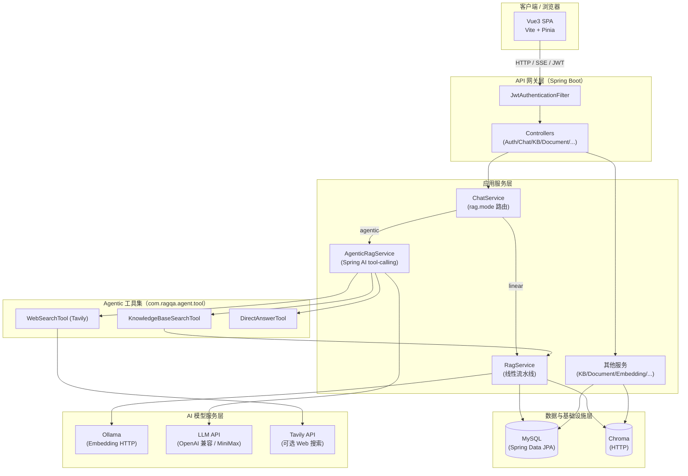
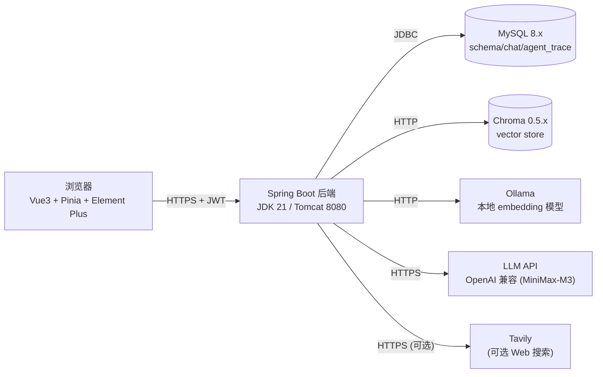
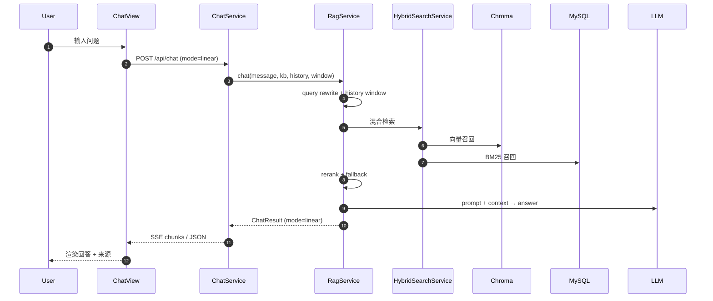
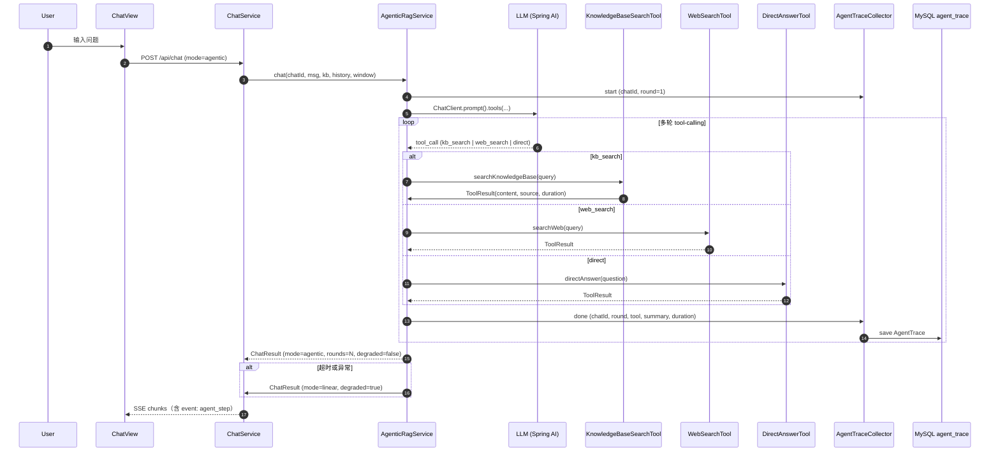
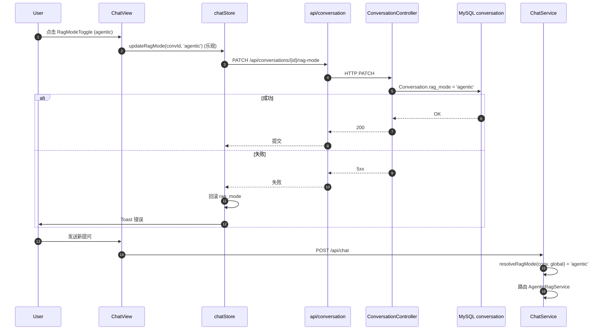
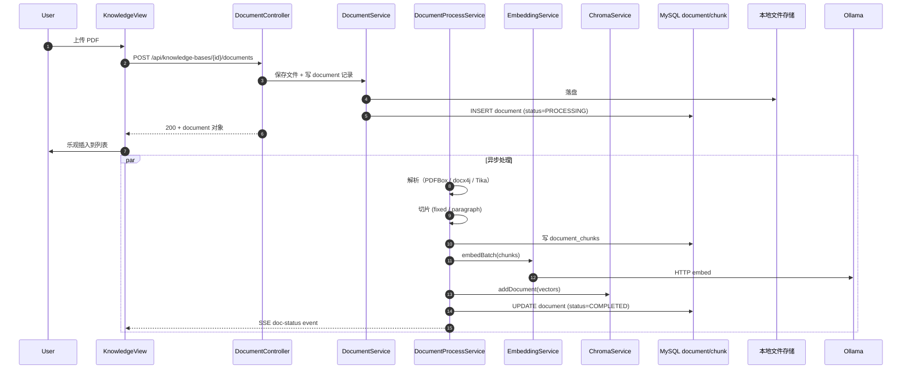
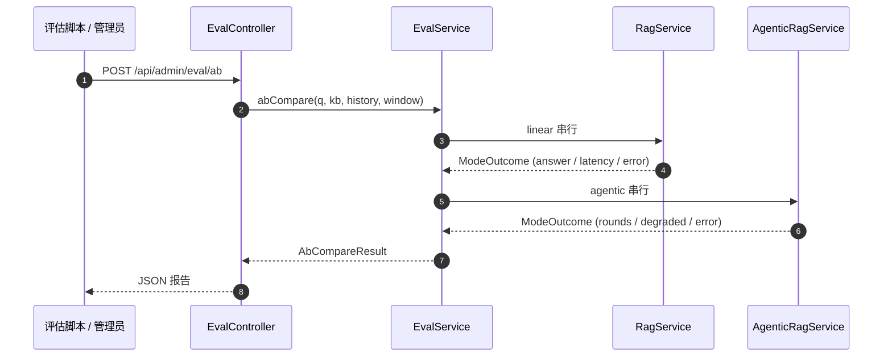

# 应用架构总览（Application Architecture Overview）

> 4+1 视图中的"+1 场景"——以五张核心场景串联整个系统的层、模块与跨进程边界。
> 详细分层、数据、运行与部署分别见同目录其他文档。

## 1. 系统层级

> **修正说明（F-007）**：原版把 Ollama 放在"数据与基础设施层"，与 MySQL/Chroma 同列。但 Ollama 是 HTTP 推理服务（提供 Embedding 模型），与 LLM API、Tavily 同属"AI 模型服务层"。架构上将其独立成层，体现"数据 vs 模型"的分离。

## 2. 容器视图（C4 Container）

## 3. 关键场景流程

### 场景 S1：朴素 RAG（linear）

### 场景 S2：Agentic RAG（agentic）

### 场景 S3：per-conversation 模式切换

### 场景 S4：文档上传与向量化

### 场景 S5：Eval A/B 对比

## 4. 横切关注点

| 关注点 | 实现位置 |
|---|---|
| 鉴权与 JWT | `JwtService` + `JwtAuthenticationFilter` + `SecurityConfig` |
| 异步任务 | `AsyncConfig.documentProcessExecutor` (core=4, max=8, queue=100) |
| SSE 流 | `ChatController.streamChat` + `DocumentController.streamDocumentStatus` + `AgentTraceCollector.sseData` |
| 线程上下文 | `KnowledgeBaseContext` / `TraceContext` (ThreadLocal) |
| 异常隔离 | Agent 工具 `try/catch` + `AgenticRagService` 30s 超时降级 |
| 配置管理 | `application.properties` 占位符 + `dotenv-spring-boot` 加载 `rag-qa-backend/.env` |
| 可观测性 | `agent_trace` 表 + `degraded` 字段 + Spring Boot Actuator + springdoc-openapi |

## 5. 架构原则

- **零重复实现**：KnowledgeBaseSearchTool 复用 RagService.retrieve 链路（召回 + rerank + fallback）。
- **协议稳定**：所有 `@Tool` 公开方法返回统一 `ToolResult(toolName, content, source, durationMs)`。
- **降级优先**：Agent 失败/超时/不支持 tool-calling 一律降级 `RagService.chat()`，主链路不挂。
- **可观测**：每轮 tool 调用 2 条 `agent_trace` (start/done)，落库失败 catch + warn 不影响主链路。
- **per-conversation 隔离**：kbId、chatId 均不暴露给 LLM（通过 ThreadLocal 注入）。

> **修正说明（F-008）**：`可观测性` 实施补充 `springdoc-openapi`（`springdoc-openapi-starter-webmvc-ui` 引入 Swagger UI），与 `spring-boot-starter-actuator` 并存。前者提供 `/swagger-ui.html` API 文档，后者提供 `/actuator/health` 健康检查与 `/actuator/prometheus` 指标。

## 6. 视图交叉索引

| 关注 | 主文档 |
|---|---|
| 模块与关键类 | [logical-view.md](./logical-view.md) |
| 数据 Schema 与迁移 | [data-view.md](./data-view.md) |
| 启动/线程/配置 | [runtime-view.md](./runtime-view.md) |
| 部署拓扑 | [deployment-view.md](./deployment-view.md) |
