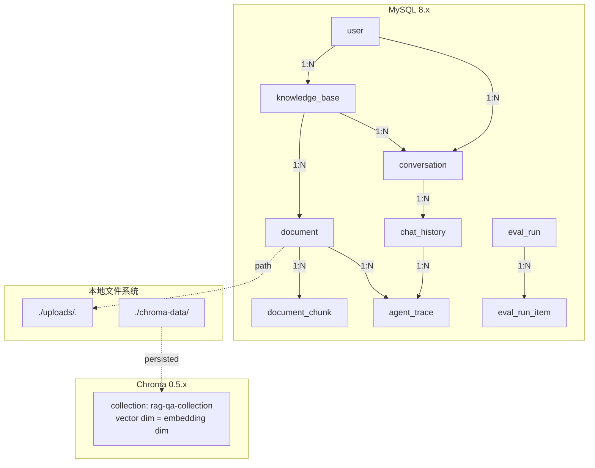
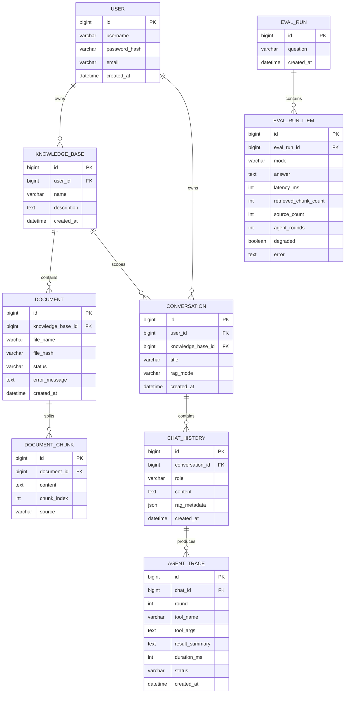
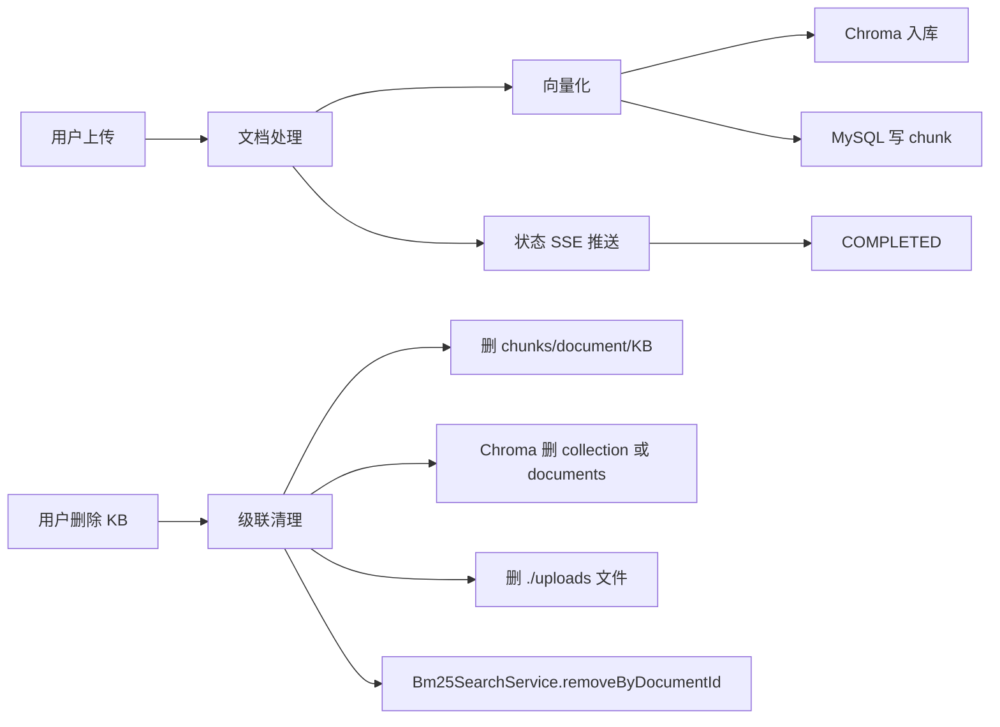

# 数据视图（Data View）

> 描绘持久化与缓存：MySQL Schema、Chroma 集合、Flyway 迁移、文件存储。

## 1. 数据存储总览



## 2. ER 概览



## 3. Flyway 迁移版本

| 版本 | 文件 | 主要变更 |
|---|---|---|
| V1 | `V1__init_schema.sql` | 初始 schema：user / knowledge_base / document / document_chunk / chat_history |
| V2 | `V2__add_user_id_to_chat_history.sql` | chat_history 加 user_id |
| V3 | `V3__redesign_chat_history.sql` | chat_history 重构（角色/元数据） |
| V4 | `V4__add_file_hash_to_document.sql` | document.file_hash（去重 + 一致性） |
| V5 | `V5__add_eval_tables.sql` | eval_run / eval_run_item（A/B 评估） |
| V6 | `V6__add_conversation_table.sql` | conversation 独立于 chat_history |
| V7 | `V7__add_rag_mode_to_conversation.sql` | conversation.rag_mode（per-conversation 模式） |
| V8 | `V8__add_agent_trace.sql` | agent_trace（Agent 可观测） |

迁移策略：

- 所有 schema 变更必须通过 Flyway 迁移脚本提交，不允许运行时 `ddl-auto: update`。
- 现有应用默认 `ddl-auto: validate`，测试环境用 H2 + `application-test.yml` (`ddl-auto: create-drop`)。

## 4. Chroma 集合

```text
Base URL:    http://localhost:8000 (CHROMA_URL)
Collection:  rag-qa-collection (CHROMA_COLLECTION)
Embed dim:   由 Ollama 模型决定 (qwen3-embedding:4b = 1024 dim)
Persisted:   ./chroma-data/ (CHROMA_PERSIST_DIR)
```

应用启动时（`ChromaConfig`）会按 `name` 命中或创建 collection，避免 409。详见 F32 设计修复。

## 5. 文件存储

| 文件 | 路径 | 用途 |
|---|---|---|
| 用户上传文件 | `./uploads/<fileHash>.<ext>` | 原始文档落盘 |
| Chroma 持久化 | `./chroma-data/` | 向量与 metadata 落盘 |
| Maven 缓存 | `~/.m2/` | 构建依赖 |
| 日志 | Spring Boot 默认 | 启动与请求日志 |

文件写入与删除由 `KnowledgeBaseService` / `DocumentService` 统一管理，删除知识库时级联清理 Chroma + BM25 + 本地文件。

## 6. 关键索引

| 表 | 索引 | 用途 |
|---|---|---|
| document | file_hash | 去重 + 一致性检查 |
| document_chunk | document_id | 切片查询 |
| chat_history | conversation_id | 会话历史查询 |
| agent_trace | (chat_id, round) | Agent 调用轮次排序 |
| eval_run_item | eval_run_id | 评估结果聚合 |

## 7. 缓存与临时存储

| 用途 | 实现 | 失效策略 |
|---|---|---|
| 文档上传临时文件 | `FILE_UPLOAD_DIR` | 删除知识库时清理 |
| 文档解析中间结果 | 内存中流转，写入 document_chunks 后丢弃 | 处理完成即释放 |
| Chroma collection id 缓存 | `ChromaConfig.cachedCollectionId` (volatile) | KB 删除/重建时 invalidate |
| LLM 聊天内存（Agent） | `MessageWindowChatMemory` (maxMessages=50) | 单次会话范围 |
| 文档状态事件 | `DocumentStatusEventService` (Reactor Sinks.buffer(100)) | 状态变更后由订阅者消费 |

## 8. 数据生命周期



## 9. 隐私与合规

- 用户密码 BCrypt 哈希存储（`UserService`）。
- JWT_SECRET 至少 32 字节，生产由 KMS 注入。
- 上传文件按 fileHash 命名，避免泄露原始文件名。
- Eval A/B 输出可被管理员访问，建议生产前加权限控制。
- Tavily Web 搜索结果保留 24-48h，无持久化（仅在 trace 中保留 summary）。
