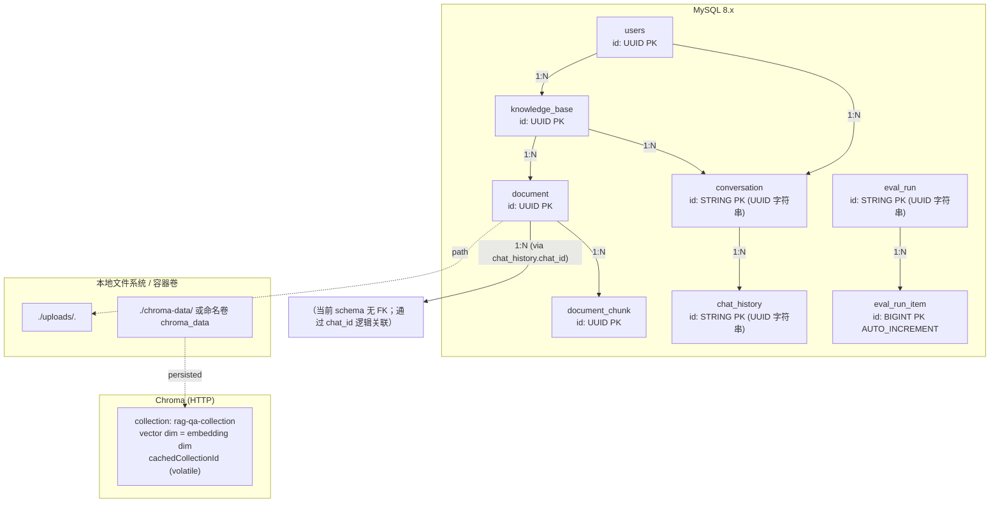
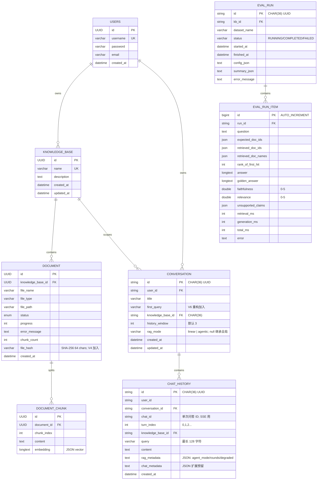
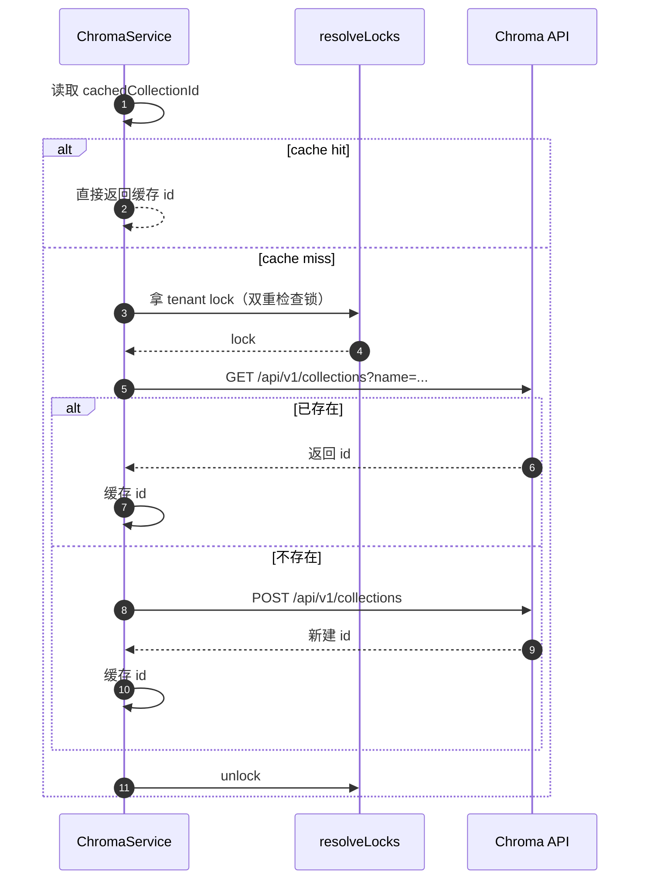
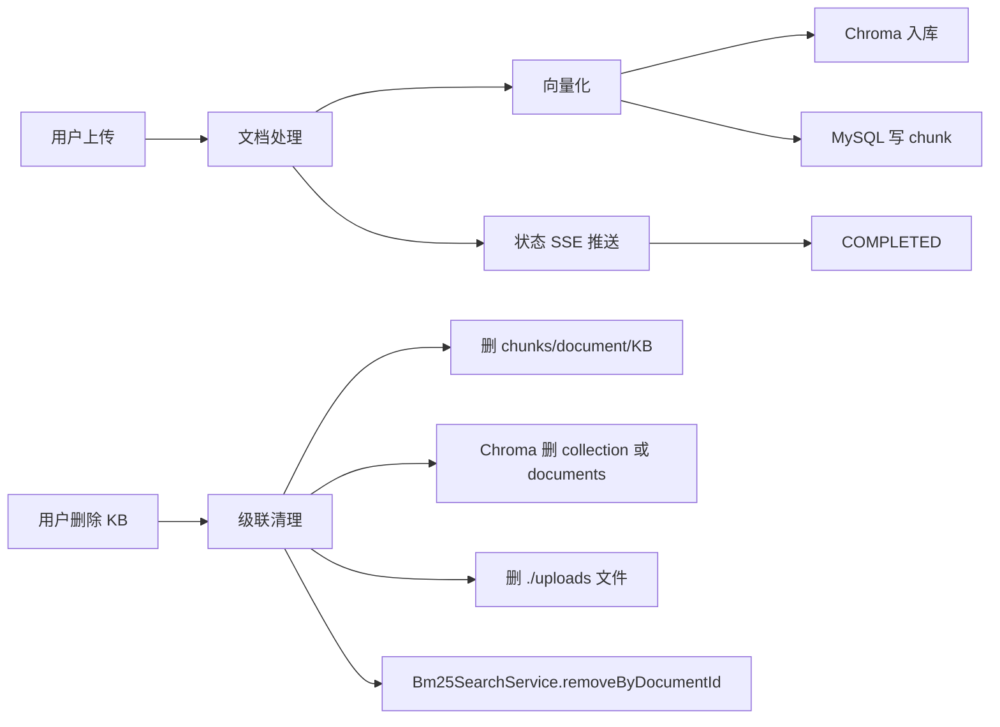

# 数据视图（Data View）

> 描绘持久化与缓存：MySQL Schema、Chroma 集合、Flyway 迁移、文件存储。
> 修正记录：F-001（主键类型）/ F-002（关键字段补全）/ F-009（ChromaConfig 缓存机制）。

## 1. 数据存储总览



> **修正说明**：原版 ER 图把所有主键标注为 `bigint`，与代码 `@Id` 字段类型不符。实际有三种主键类型：
> - UUID（@GeneratedValue UUID）→ Document / DocumentChunk / KnowledgeBase / User
> - String（CHAR(36) UUID 字符串 + `@PrePersist` 兜底）→ Conversation / ChatHistory / EvalRun
> - Long（@GeneratedValue IDENTITY）→ EvalRunItem

## 2. ER 概览



> **修正说明（F-002）**：原版 ER 图字段过少。补充以下关键字段：
>
> - `Conversation.first_query`（V6 重构加入）
> - `Conversation.history_window`（默认 3，前端可配）
> - `Conversation.rag_mode`（per-conversation 覆盖，nullable）
> - `Document.file_hash`（V4 加入，SHA-256 内容去重）
> - `Document.chunk_count`（切片数）
> - `Document.error_message`（处理失败信息）
> - `DocumentChunk.embedding`（LONGTEXT，JSON 形式存储）
> - `DocumentChunk.chunk_index`（切片序号）
> - `ChatHistory.chat_id`（单次问答 ID，SSE session 用）
> - `ChatHistory.turn_index`（轮次）
> - `ChatHistory.rag_metadata`（含 `agent_mode` / `agent_rounds` / `degraded`）
> - `EvalRunItem` 全部评估指标字段

## 3. 实体关键字段详解

### 3.1 `users`（用户表）

| 字段 | 类型 | 约束 | 用途 |
|---|---|---|---|
| id | UUID | PK, auto | 用户唯一标识 |
| username | varchar | NOT NULL, UNIQUE | 登录名 |
| password | varchar | NOT NULL | BCrypt 哈希 |
| email | varchar | nullable | 联系方式 |
| created_at | datetime | auto | 注册时间 |

实现 `UserDetails` 接口，Spring Security 用 `ROLE_USER` 授权。

### 3.2 `knowledge_base`（知识库表）

| 字段 | 类型 | 约束 | 用途 |
|---|---|---|---|
| id | UUID | PK, auto | 知识库 ID |
| name | varchar | NOT NULL, UNIQUE | 知识库名（不可重复） |
| description | text | nullable | 描述 |
| created_at / updated_at | datetime | auto | 时间戳 |

### 3.3 `document`（文档表）

| 字段 | 类型 | 约束 | 用途 |
|---|---|---|---|
| id | UUID | PK, auto | 文档 ID |
| knowledge_base_id | UUID | FK, NOT NULL | 所属知识库 |
| file_name | varchar | NOT NULL | 原始文件名 |
| file_type | varchar | nullable | pdf / docx / txt |
| file_path | varchar | nullable | 本地存储路径 |
| status | enum | DocumentStatus | UPLOADING/PARSING/CHUNKING/EMBEDDING/COMPLETED/FAILED |
| progress | int | 0-100 | 进度 |
| error_message | text | nullable | 失败信息 |
| chunk_count | int | default 0 | 切片数 |
| **file_hash** | varchar(64) | nullable | **V4 加入，SHA-256 内容去重** |

`DocumentStatus` 枚举：`UPLOADING(10%)` / `PARSING(30%)` / `CHUNKING(50%)` / `EMBEDDING(70-100%)` / `COMPLETED(100%)` / `FAILED`。

### 3.4 `document_chunk`（切片表）

| 字段 | 类型 | 约束 | 用途 |
|---|---|---|---|
| id | UUID | PK, auto | 切片 ID |
| document_id | UUID | FK, NOT NULL | 所属文档 |
| chunk_index | int | nullable | 切片序号 |
| content | text | nullable | 原文 |
| embedding | longtext | nullable | **JSON 形式存储的向量**（应用层用，Chroma 也存一份） |

### 3.5 `conversation`（对话组表，V6 重构加入）

| 字段 | 类型 | 约束 | 用途 |
|---|---|---|---|
| id | String CHAR(36) | PK, UUID 字符串 | 对话组 ID |
| user_id | varchar(64) | NOT NULL | 所属用户 |
| title | varchar(255) | nullable | 大模型生成的首轮摘要 |
| **first_query** | varchar(255) | nullable | **V6 加入，第一轮原始问题（历史列表展示用）** |
| knowledge_base_id | CHAR(36) | nullable | 所属知识库 |
| **history_window** | int | default 3 | **滑动窗口大小（1-10，前端可配）** |
| **rag_mode** | varchar(16) | nullable | **per-conversation 模式（V7 加入）：linear / agentic；null 继承全局** |
| created_at / updated_at | datetime | auto | 时间戳 |

### 3.6 `chat_history`（单次问答表，V6 重构）

| 字段 | 类型 | 约束 | 用途 |
|---|---|---|---|
| id | String CHAR(36) | PK | 主键 |
| user_id | varchar(64) | nullable | 所属用户 |
| conversation_id | varchar(36) | nullable | 所属对话组 |
| **chat_id** | varchar(36) | nullable | **单次问答 ID（agent_trace 外键 + SSE session-start）** |
| **turn_index** | int | nullable | 轮次（0,1,2...） |
| knowledge_base_id | CHAR(36) | nullable | 所属知识库 |
| query | varchar(128) | nullable | 用户问题 |
| content | text | NOT NULL | 模型答案 |
| **rag_metadata** | text | nullable | **JSON：`agent_mode` / `agent_rounds` / `degraded`** |
| **chat_metadata** | text | nullable | 扩展元数据（预留） |
| created_at | datetime | auto | 创建时间 |

### 3.7 `agent_trace`（V8 加入）

> 注：`agent_trace` 没有 JPA 实体类，直接通过 `AgentTrace` record + `AgentTraceRepository` 写入；不在 JPA 扫描范围。

| 字段 | 类型 | 约束 | 用途 |
|---|---|---|---|
| id | bigint | PK, auto | trace ID |
| chat_id | bigint | INDEX | 关联 chat_history.id |
| round | int | NOT NULL | 工具调用轮次 |
| tool_name | varchar(64) | NOT NULL | kb_search / web_search / direct_answer |
| tool_args | text | nullable | JSON: `{"query":"..."}` |
| result_summary | text | nullable | 500 字截断 + 省略号 |
| duration_ms | int | nullable | 工具耗时 |
| status | varchar(16) | NOT NULL | start / done |
| created_at | datetime | default NOW | 时间戳 |

索引：`(chat_id, round)` 复合索引。

### 3.8 `eval_run` / `eval_run_item`（V5 加入）

`eval_run` 主键 String CHAR(36)，存放整次评测的元数据与汇总。`eval_run_item` 主键 Long AUTO_INCREMENT，存放每条 Q&A 的指标（faithfulness / relevance / rank_of_first_hit / total_ms 等）。

## 4. Chroma 集合与缓存机制

```text
Base URL:    ${CHROMA_URL:http://localhost:8000}
Collection:  ${CHROMA_COLLECTION:rag-qa-collection}
Embed dim:   由 Ollama 模型决定（qwen3-embedding:4b = 1024 dim）
Persisted:   ${CHROMA_PERSIST_DIR:./chroma-data}
```

### 4.1 cachedCollectionId 缓存（F-009 补充）

`ChromaConfig` 在内存中维护一个 `cachedCollectionId` (volatile) 与 `resolveLocks` (ConcurrentHashMap<tenant, Lock>)：

```java
volatile String cachedCollectionId;
ConcurrentHashMap<String, ReentrantLock> resolveLocks = new ConcurrentHashMap<>();
```

启动流程：



> 这个机制是 F32 修复（Chroma 409 修复）的核心：通过 `name` 命中复用 id，避免并发创建时同名 collection 冲突。

### 4.2 缓存失效

- 进程重启 → volatile 失效，重新走 `getOrCreateCollectionId`（轻量 HTTP）
- KB 删除 → `KnowledgeBaseService.delete()` 调用 `invalidateCollectionIdCache()`
- 手工调用 `ChromaConfig.invalidateCollectionIdCache()` 强制重读

## 5. Flyway 迁移版本

| 版本 | 文件 | 主要变更 |
|---|---|---|
| V1 | `V1__init_schema.sql` | 初始 schema：user / knowledge_base / document / document_chunk / chat_history |
| V2 | `V2__add_user_id_to_chat_history.sql` | chat_history 加 user_id |
| V3 | `V3__redesign_chat_history.sql` | chat_history 重构（角色/元数据） |
| V4 | `V4__add_file_hash_to_document.sql` | document.file_hash（SHA-256 内容去重） |
| V5 | `V5__add_eval_tables.sql` | eval_run / eval_run_item（A/B 评估） |
| V6 | `V6__add_conversation_table.sql` | conversation 独立于 chat_history |
| V7 | `V7__add_rag_mode_to_conversation.sql` | conversation.rag_mode（per-conversation 模式） |
| V8 | `V8__add_agent_trace.sql` | agent_trace（Agent 可观测） |

迁移策略：

- 所有 schema 变更必须通过 Flyway 迁移脚本提交，不允许运行时 `ddl-auto: update`。
- 现有应用默认 `ddl-auto: validate`，测试环境用 H2 + `application-test.yml` (`ddl-auto: create-drop`)。
- `eval_run.id` / `kb_id` / `run_id` 在 V5 migration 是 CHAR(36)；JPA 用 `String` + `columnDefinition = "CHAR(36)"` 显式声明，避免 Hibernate schema-validation 失败。

## 6. 文件存储

| 文件 | 路径 | 用途 |
|---|---|---|
| 用户上传文件 | `./uploads/<fileHash>.<ext>` | 原始文档落盘（按 SHA-256 命名去重） |
| Chroma 持久化 | `./chroma-data/`（本地）/ 命名卷 `chroma_data`（容器） | 向量与 metadata 落盘 |
| Maven 缓存 | `~/.m2/` | 构建依赖 |
| 日志 | Spring Boot 默认 | 启动与请求日志 |

文件写入与删除由 `KnowledgeBaseService` / `DocumentService` 统一管理，删除知识库时级联清理 Chroma + BM25 + 本地文件。

## 7. 关键索引

| 表 | 索引 | 用途 |
|---|---|---|
| document | file_hash | 去重 + 一致性检查 |
| document | knowledge_base_id | 按 KB 查询 |
| document_chunk | document_id | 切片查询 |
| conversation | user_id | 用户隔离 |
| chat_history | conversation_id | 会话历史查询 |
| chat_history | chat_id | 关联 agent_trace |
| agent_trace | (chat_id, round) | Agent 调用轮次排序 |
| agent_trace | created_at | 时间序列 |
| eval_run | kb_id | 按 KB 查询评估 |
| eval_run_item | run_id | 评估结果聚合 |
| users | username UNIQUE | 登录唯一性 |

## 8. 缓存与临时存储

| 用途 | 实现 | 失效策略 |
|---|---|---|
| 文档上传临时文件 | `FILE_UPLOAD_DIR` | 删除知识库时清理 |
| 文档解析中间结果 | 内存中流转，写入 document_chunks 后丢弃 | 处理完成即释放 |
| Chroma collection id 缓存 | `ChromaConfig.cachedCollectionId` (volatile) + `resolveLocks` | KB 删除/重建时 `invalidateCollectionIdCache()` |
| LLM 聊天内存（Agent） | `MessageWindowChatMemory` (maxMessages=50) | 单次会话范围 |
| 文档状态事件 | `DocumentStatusEventService` (`Sinks.Many.multicast().onBackpressureBuffer(100)`) | 状态变更后由订阅者消费 |

> **运行时未启用 `Spring Cache`**（F-005 修正）：当前 `@EnableCaching` 尚未启用，本节"缓存"指进程内缓存与外部事件总线，不含 `Caffeine` / `Redis` 等 LRU 缓存层。

## 9. 数据生命周期



## 10. 隐私与合规

- 用户密码 BCrypt 哈希存储（`UserService`）。
- JWT_SECRET 至少 32 字节，生产由 KMS 注入。
- 上传文件按 fileHash 命名，避免泄露原始文件名。
- Eval A/B 输出可被管理员访问，建议生产前加权限控制。
- Tavily Web 搜索结果保留 24-48h，无持久化（仅在 trace 中保留 summary）。
