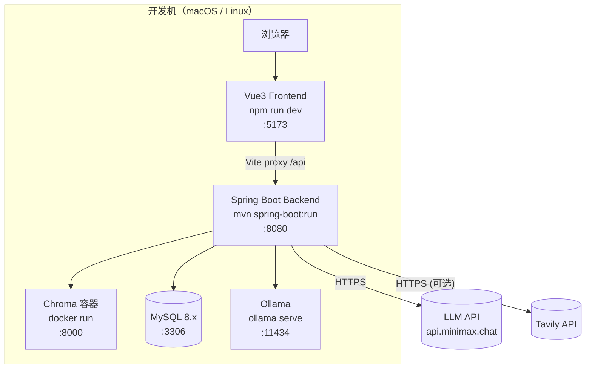
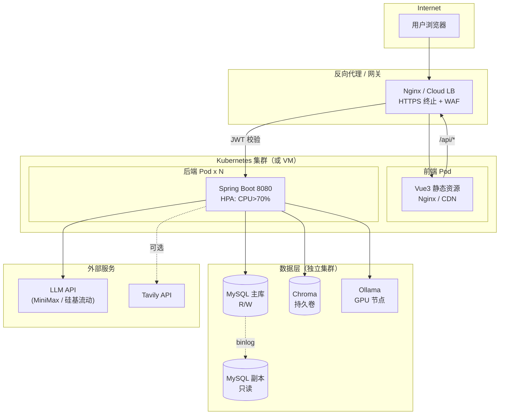

# 部署视图（Deployment View）

> 描绘生产/开发部署拓扑、容器编排、端口、依赖、扩容与运维约束。

## 1. 本地开发部署



启动命令（参见 `env-guide.md`）：

```bash
# 后端
cd rag-qa-backend && mvn spring-boot:run > /tmp/rag-qa-backend.log 2>&1 &

# 前端
cd rag-qa-frontend && npm run dev > /tmp/rag-qa-frontend.log 2>&1 &
```

健康检查：

```bash
curl -f http://localhost:8080/actuator/health
curl -f http://localhost:5173
```

## 2. Docker Compose 部署

项目根目录已有 `docker-compose.yml`：

```yaml
services:
  mysql:
    image: mysql:8.0
    ports: ["3306:3306"]
    environment:
      MYSQL_ROOT_PASSWORD: ${DB_PASSWORD}
      MYSQL_DATABASE: ${DB_NAME}
  chroma:
    image: chromadb/chroma
    ports: ["8000:8000"]
    volumes:
      - ./chroma-data:/chroma/.chroma
  backend:
    build: ./rag-qa-backend
    ports: ["8080:8080"]
    depends_on: [mysql, chroma]
    env_file: ./rag-qa-backend/.env
  frontend:
    build: ./rag-qa-frontend
    ports: ["5173:5173"]
    depends_on: [backend]
```

## 3. 生产部署拓扑



### 关键部署约束

- **后端无状态**：可水平扩展，依靠 MySQL 与 Chroma 共享状态。
- **MySQL 主从**：写主库、读副本，由 Spring 路由（读写分离可后续扩展）。
- **Chroma 持久卷**：必须挂载持久化卷；collection 通过 `name` 复用避免 409（F32 修复）。
- **Ollama**：建议独立 GPU 节点；embedding 调用 HTTP，可水平扩展。
- **Tavily**：可选外部 SaaS，未配置时 WebSearchTool 不注册。

## 4. 端口与依赖

| 服务 | 端口 | 协议 | 内部/外部 |
|---|---|---|---|
| Spring Boot | 8080 | HTTP | 内部 |
| Vue3 Dev Server | 5173 | HTTP | 内部（仅 dev） |
| MySQL | 3306 | TCP | 内部 |
| Chroma | 8000 | HTTP | 内部 |
| Ollama | 11434 | HTTP | 内部 |
| LLM API | 443 | HTTPS | 外部 |
| Tavily API | 443 | HTTPS | 外部 |

## 5. 健康检查与就绪探针

| 探针 | URL | 用途 |
|---|---|---|
| Spring Boot Liveness | `GET /actuator/health/liveness` | 进程是否存活 |
| Spring Boot Readiness | `GET /actuator/health/readiness` | 数据库/Chroma 是否可达 |
| MySQL | `mysqladmin ping` | 数据库存活 |
| Chroma | `GET /api/v1/heartbeat` | 向量服务存活 |
| Ollama | `GET /api/tags` | Embedding 服务存活 |

## 6. 扩容策略

| 维度 | 策略 |
|---|---|
| 后端 CPU | HPA：CPU > 70% 扩容 |
| 后端 内存 | 1-2 GB/Pod，按 SSE 并发调整 |
| MySQL | 主从读写分离 + 连接池 max=20 |
| Chroma | 单实例（PoC 阶段），生产建议 Sharding |
| Ollama | GPU 节点独立扩缩容，按 embedding QPS 调整 |
| LLM API | 走外部限流策略，重要场景加熔断 |

## 7. 备份与恢复

| 资产 | 备份策略 |
|---|---|
| MySQL | mysqldump 每日全量 + binlog 实时增量；保留 30 天 |
| Chroma | 持久卷快照（每日）；按 collection export JSON 备份 |
| 上传文件 | 同步对象存储（OSS / S3） |
| Ollama 模型 | 镜像层缓存 |
| 配置文件 | 全部走 .env，模板入 Git，真实值入 KMS/SOPS |

## 8. 监控与告警

- **后端**：Prometheus 抓取 /actuator/prometheus；Grafana 仪表盘。
- **MySQL**：连接数 / 慢查询 / 主从延迟。
- **Chroma**：QPS / p99 延迟 / collection 数量。
- **Ollama**：GPU 利用率 / 队列长度。
- **LLM API**：调用次数 / 失败率 / 配额。
- **Agentic 降级率**：统计 `degraded=true` 的请求占比。

告警阈值建议：

- 后端 p99 > 2s 持续 5 分钟 → Slack 告警。
- Agentic 降级率 > 10% → 立即排查 LLM 配额。
- MySQL 连接池使用率 > 80% → 扩容或限流。

## 9. 安全清单

- [x] JWT 鉴权 + BCrypt 密码哈希
- [x] CORS 配置（CorsConfig）
- [x] 路径遍历双层防御（DocumentService.uploadDocument）
- [x] JWT_SECRET 至少 32 字节
- [x] 上传文件按 fileHash 命名
- [x] SQL/JPA 注入防护
- [ ] 限流（RateLimiter）建议加（生产前）
- [ ] WAF 规则（生产前）
- [ ] 审计日志（管理员操作）
