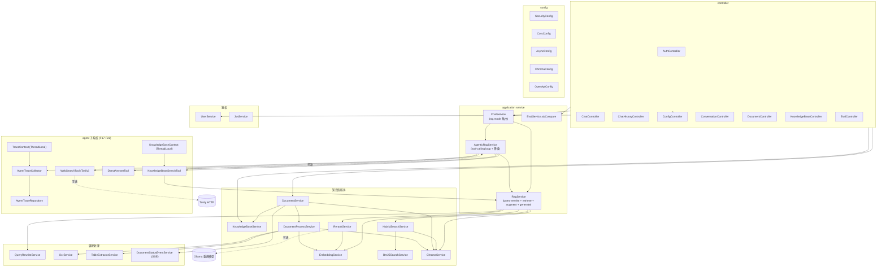
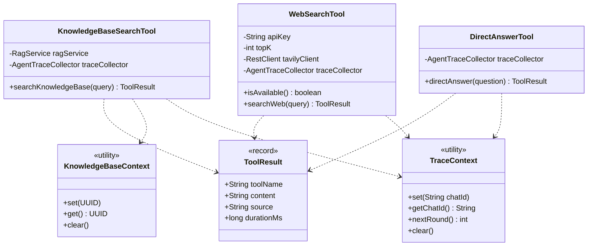
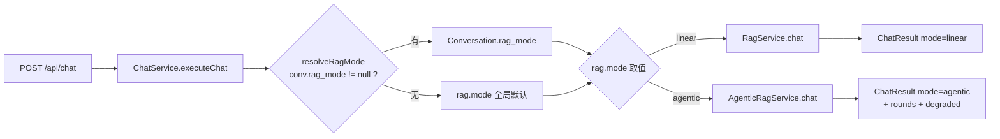
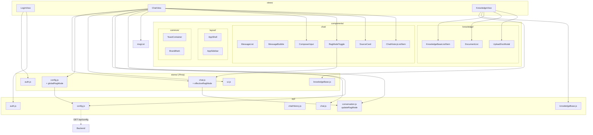

# 逻辑视图（Logical View）

> 描绘后端与前端的模块划分、关键类、RAG 模式路由、Agent 工具集。
> 重点说明朴素 RAG 与 Agentic RAG 在同一系统内的并存与边界。

## 1. 后端模块（com.ragqa.*）



## 2. 关键类与契约

### 2.1 Tool 抽象（agent.tool 包）



### 2.2 RAG 模式路由



优先级：`conversation.rag_mode` 非 null > 全局 `rag.mode`；null 继承全局。

### 2.3 Agent Loop 与降级

```mermaid
flowchart TB
  Start[AgenticRagService.chat] --> Ctx[KnowledgeBaseContext.set(kbId)<br/>TraceContext.set(chatId)]
  Ctx --> Future[CompletableFuture.supplyAsync]
  Future --> Loop{Spring AI<br/>tool-calling loop}
  Loop -- "多轮工具调用" --> Tools[KnowledgeBaseSearchTool / WebSearchTool / DirectAnswerTool]
  Tools --> Loop
  Loop -- "完成" --> Resp[ChatResult mode=agentic<br/>rounds=N, degraded=false]
  Loop -- "TimeoutException" --> Cancel[future.cancel(true)]
  Cancel --> Degrade
  Future -- "其他异常" --> Degrade[markDegraded() + RagService.chat]
  Degrade --> RespL[ChatResult mode=linear<br/>degraded=true, rounds=0]
  Resp --> Ctx2[finally clear ThreadLocal]
  RespL --> Ctx2
```

降级触发：30s 总超时 / LLM 不支持 tool-calling / 任何未捕获异常 / 单边 try/catch。

## 3. 前端模块（Vue3 + Pinia）



## 4. 关键设计决策

| 决策 | 原因 | 影响 |
|---|---|---|
| Tool 抽象统一返回 `ToolResult` record | 多工具统一格式便于 trace 与 LLM schema 生成 | 工具集可插拔；新增 tool 不影响 ChatClient |
| kbId / chatId 用 ThreadLocal | 不暴露给 LLM schema generation | 避免 LLM 瞎填或跨库串答 |
| `internalToolExecutionEnabled=true` + `CompletableFuture` 30s 超时 | Spring AI 1.1.3 无 `maxIterations` API | 避免 agent 死循环；超时降级 linear |
| RerankService + HybridSearchService + Bm25SearchService | 向量 + BM25 双路召回 + 重排序 | 提升检索召回率与精排质量 |
| Fallback 到 MySQL 余弦相似度 | Chroma 不可用时不挂主链路 | 提升可用性 |
| 文档处理走 `@Async` 线程池 | 长任务不阻塞 HTTP 线程 | 提升响应；P0 修复过线程安全问题 |
| Conversation 替代旧的 ChatHistory | 减少 chat_history.rag_metadata JSON 膨胀 | 数据模型清晰 |
| TraceContext 自增 round | 同一 chat 多轮 tool 调用可区分 | trace 落库可按 round 排序 |
| WebSearchTool 在无 TAVILY_API_KEY 时不注册 | agent 不再尝试不可用工具 | 优雅降级 |

## 5. 跨模块调用矩阵

| 源模块 | 目标模块 | 触发场景 |
|---|---|---|
| ChatController | ChatService | 问答请求 |
| ChatController | AgentTraceCollector | 流式推送 agent_step |
| ChatService | RagService | linear 路径 |
| ChatService | AgenticRagService | agentic 路径 |
| AgenticRagService | KnowledgeBaseSearchTool | kb_search |
| AgenticRagService | WebSearchTool | web_search |
| AgenticRagService | DirectAnswerTool | direct_answer |
| KnowledgeBaseSearchTool | RagService | 复用 retrieve 链路 |
| WebSearchTool | Tavily API | 外部 HTTP |
| RagService | HybridSearchService | 混合检索（向量 + BM25 双路） |
| RagService | RerankService | 召回重排（TOP_K 精排；Ollama 失败自动降级） |
| RagService | QueryRewriteService | 查询改写（多轮上下文感知） |
| RagService | ChromaService | fallback 检索（Chroma 不可用时 MySQL 余弦相似度） |
| RagService | EmbeddingService | embedding 向量计算 |
| HybridSearchService | ChromaService | 向量召回 |
| HybridSearchService | Bm25SearchService | BM25 召回 |
| RerankService | EmbeddingService | 重排 embedding（rerank model） |
| DocumentProcessService | EmbeddingService | 向量化 |
| DocumentProcessService | ChromaService | 向量入库 |
| DocumentProcessService | DocumentStatusEventService | 状态广播 |
| EvalService | RagService | linear 模式 |
| EvalService | AgenticRagService | agentic 模式 |

## 6. 模块依赖原则

- **controller → service 单向**：controller 不直接调用 repository。
- **service → repository 单向**：跨表操作封装在 service 内。
- **agent 子系统复用 service**：KnowledgeBaseSearchTool 复用 RagService，不重写检索。
- **trace 解耦**：AgentTraceCollector 注入到所有 tool，但与主链路 catch 隔离。
- **事件总线**：DocumentStatusEventService 使用 Reactor Sinks，不阻塞状态写。
