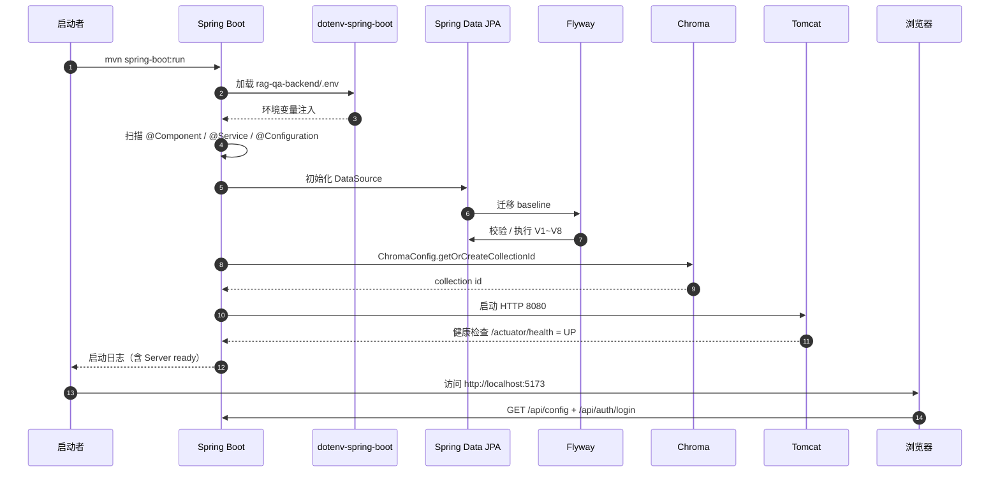
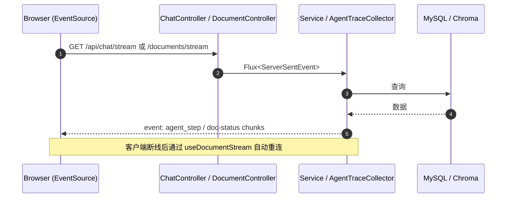
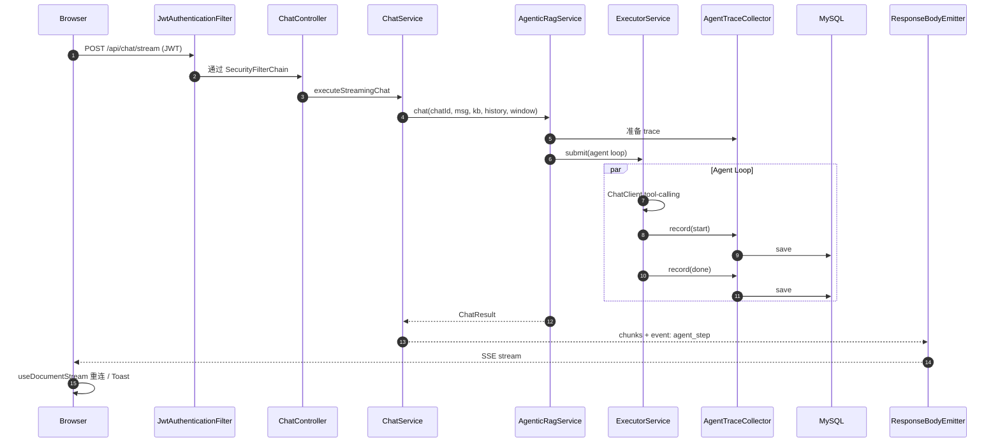

# 运行视图（Runtime View）

> 描绘进程内运行时特征：启动顺序、线程模型、SSE 流、配置加载、依赖管理。

## 1. 启动顺序



## 2. 进程内模块装配（按 Spring Bean 依赖）

```mermaid
flowchart TB
  Props[application.properties<br/>${ENV} 注入] --> ConfigBeans[Config Beans]
  ConfigBeans --> Services[Service Beans]
  Services --> Agentic[Agent 子系统]
  Services --> Repos[Repository Beans]
  Repos --> DB[MySQL]
  ConfigBeans --> Security[SecurityConfig + JwtFilter]
  Services --> ControllerBeans[Controller Beans]
  ControllerBeans --> Tomcat[Tomcat DispatcherServlet]

  Agentic --> Tools[KnowledgeBaseSearchTool / WebSearchTool / DirectAnswerTool]
  Tools --> RagService
  Tools --> TavilyAPI[Tavily HTTP]
  Agentic --> Trace[AgentTraceCollector]
  Trace --> Repo[AgentTraceRepository]
```

## 3. 线程模型

| 线程 | 用途 | 配置位置 |
|---|---|---|
| Tomcat HTTP 线程（默认 200） | 处理 HTTP 请求、SSE | `server.tomcat.threads.max` |
| `documentProcessExecutor` | 文档解析、向量化、入库 | `AsyncConfig`：core=4, max=8, queue=100 |
| `AgenticRagService` Executor | Agent tool-calling loop | `AgenticRagService` 内部 ExecutorService |
| `DocumentStatusEventService` Reactor 调度 | 状态 SSE 推送 | Reactor Sinks |
| `ScheduledExecutor` | 卡死文档回收 | `DocumentProcessRecoveryScheduler` |
| `LlmChatMemory` | Spring AI 聊天内存 | `MessageWindowChatMemory(maxMessages=50)` |

线程安全要点：

- `Bm25SearchService` 使用 `ReentrantReadWriteLock` + `ConcurrentHashMap`（P0 修复）。
- `ChromaConfig.cachedCollectionId` 使用 `volatile` + `resolveLocks`（tenant 级锁）。
- `KnowledgeBaseContext` / `TraceContext` 为 ThreadLocal，每个请求必须 `set → clear`。

## 4. SSE 推送模型



事件命名约定：

| 事件 | 来源 | 用途 |
|---|---|---|
| `agent_step` | AgenticRagService | 每轮 tool 调用推送 start/done |
| `doc-status` | DocumentStatusEventService | 文档状态变更推送 |
| `chat-chunk` | ChatController.streamChat | LLM 流式输出 |
| (default) | RagService | 流式回答文本 |

## 5. 配置加载

```text
启动顺序：
1. dotenv-spring-boot 读取 rag-qa-backend/.env
2. Spring 加载 application.properties (classpath)
3. application.properties 通过 ${ENV} 引用 .env 中的值
4. @ConfigurationProperties / @Value 注入到 Bean
5. Bean 装配图按 @DependsOn / @Autowired 解析
```

| 配置 | 来源 | 用途 |
|---|---|---|
| `OPENAI_API_KEY` / `OPENAI_BASE_URL` / `OPENAI_MODEL` | .env | LLM 客户端 |
| `DB_HOST` / `DB_NAME` / `DB_USER` / `DB_PASSWORD` | .env | MySQL DataSource |
| `CHROMA_PERSIST_DIR` / `CHROMA_COLLECTION` | .env | 向量存储 |
| `OLLAMA_BASE_URL` / `OLLAMA_EMBEDDING_MODEL` | .env | Embedding |
| `RAG_MODE` / `RAG_AGENT_TIMEOUT_MS` / `RAG_WEB_TOPK` / `RAG_WEB_TIMEOUT_MS` | .env | Agentic 行为 |
| `TAVILY_API_KEY` | .env | Web 搜索（可空） |
| `JWT_SECRET` | .env | JWT 签名 |
| `SERVER_PORT` | .env | HTTP 端口 |

`.env.example` 与 `rag-qa-backend/.env.example` 提供模板；`.env` 被 `.gitignore` 忽略。

## 6. 关键运行配置

```text
# application.properties 关键项
spring.ai.openai.api-key=${OPENAI_API_KEY}
spring.ai.openai.base-url=${OPENAI_BASE_URL}
spring.ai.openai.chat.options.model=${OPENAI_MODEL:abab5.5-chat}
spring.ai.vectorstore.chroma.enabled=false
spring.ai.vectorstore.chroma.url=${CHROMA_URL:http://localhost:8000}
spring.ai.vectorstore.chroma.collection-name=${CHROMA_COLLECTION:rag-qa-collection}
spring.datasource.url=jdbc:mysql://${DB_HOST:localhost}:${DB_PORT:3306}/${DB_NAME:ragqa}...
spring.jpa.hibernate.ddl-auto=validate
spring.flyway.enabled=true
rag.mode=${RAG_MODE:linear}
rag.agent.model=${RAG_AGENT_MODEL:MiniMax-M3}
rag.agent.timeout-ms=${RAG_AGENT_TIMEOUT_MS:30000}
rag.web.search.api-key=${TAVILY_API_KEY:}
rag.web.search.topk=${RAG_WEB_TOPK:5}
rag.web.search.timeout-ms=${RAG_WEB_TIMEOUT_MS:8000}
```

## 7. 请求生命周期（以 Agentic 流式问答为例）



## 8. 异常处理与降级

| 异常 | 处理位置 | 行为 |
|---|---|---|
| Chroma 不可用 | RagService.fallbackRetrieve | 回退 MySQL 余弦相似度 |
| Tavily 不可用 / 401 | WebSearchTool.searchWeb | 返回 "Web 搜索失败" ToolResult |
| LLM 不支持 tool-calling | AgenticRagService 异常 | catch + markDegraded() + 降级 linear |
| 总超时 30s | CompletableFuture.get timeout | future.cancel(true) + 降级 linear |
| 文档解析失败 | DocumentProcessService | status=FAILED + error_message + SSE 推送 |
| trace 落库失败 | AgentTraceCollector | catch + log warn，不影响主链路 |

## 9. 监控与可观测

- Spring Boot Actuator：`/actuator/health` 健康检查。
- agent_trace 表：每轮 tool 调用的完整记录（tool_name / args / summary / duration / status）。
- chat_history.rag_metadata：包含 `agent_mode` / `agent_rounds` / `degraded`。
- Eval A/B 报告：linear vs agentic 量化对比。
- 日志：Spring Boot 默认 logback，trace 落库失败有 `[agent_trace] save failed` warn。
